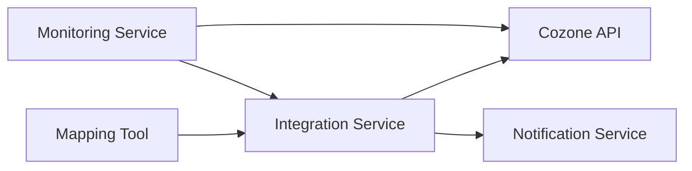

#### 1. High-Level Design

- **Summary**: This epic delivers seamless integration between the automated mapping tool and Azets Cozone platform, enabling direct updates of mapped accounts to the master ledger without manual intervention. Once mapping is finalized and approved, the system automatically pushes mapped accounts to Cozone within 2 minutes, with real-time synchronization, error handling for API failures, and success notifications to users.

- **Component Flow**:

- **Integration Points**: 
  - Cozone platform API for ledger updates
  - Cozone API authentication and authorization services
  - Monitoring systems for API health checks
  - Fallback manual export/import capability

- **Key Assumptions**: 
  - Cozone API provides stable endpoints for ledger updates with documented versioning
  - Approval workflow for mapped accounts is handled by the Mapping Tool before triggering integration

- **NFR Highlights**: Ledger updates within 2 minutes of approval; support for 100 concurrent sessions; TLS 1.2+ encryption; automated failover for API downtime; 99.9% uptime requirement

- **Data Flow**: Upon mapping approval in the Mapping Tool, the Integration Service receives the finalized mapped accounts. The service authenticates with Cozone API and pushes the mapped accounts to the master ledger. The Monitoring Service continuously checks API health and triggers automated retry logic if failures occur. Upon successful update or failure, the Notification Service sends status notifications to users. If API is unavailable, the system provides fallback manual export/import capability.

#### 2. Validation Report

- **Requirements Coverage**: The design covers all stated requirements including direct Cozone API integration, real-time ledger updates within 2 minutes, success/failure notifications, API versioning support, automated retry logic, and fallback manual export/import capability. The architecture supports the NFRs for update speed (2 minutes), concurrent sessions (100), encryption (TLS 1.2+), automated failover, and uptime (99.9%). Integration with Cozone platform API, authentication services, and monitoring systems is included in the component flow.