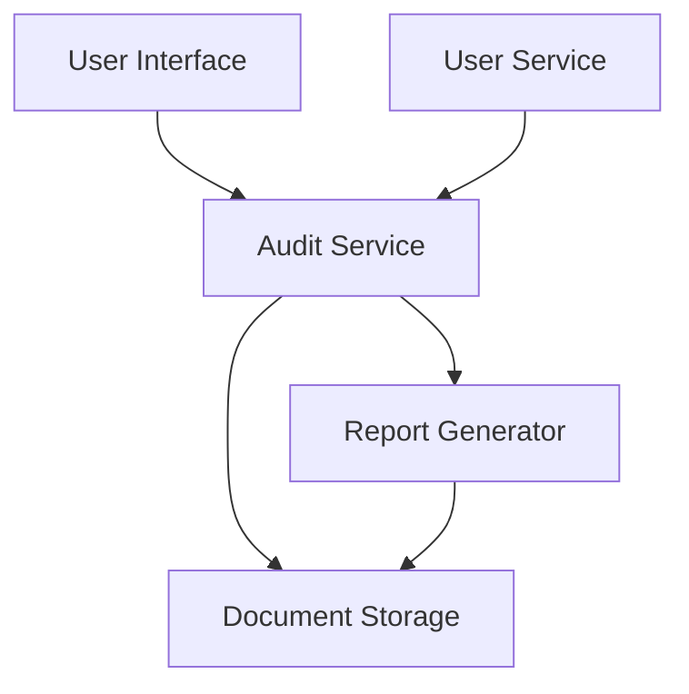

#### 1. High-Level Design

- **Summary**: This epic delivers comprehensive audit-ready reporting capabilities that document all mapping decisions, manual overrides, timestamps, and user actions throughout the integration process. The system generates downloadable reports in PDF and CSV formats that meet compliance requirements and support internal and external audits, ensuring full traceability of all mapping activities and supporting GDPR compliance and Azets internal audit policies.

- **Component Flow**:

- **Integration Points**: 
  - User-Service for access controls and audit logging
  - Document generation services for PDF/CSV export
  - Secure storage systems for historical data retention (7-year minimum)

- **Key Assumptions**: 
  - Mapping decisions and overrides are captured in a structured format suitable for report generation
  - User authentication and authorization are handled by the existing User-Service

- **NFR Highlights**: Reports must be generated within 30 seconds; 7-year data retention with AES-256 encryption at rest; GDPR and Azets policy compliance; WCAG 2.1 AA accessibility standards

- **Data Flow**: Users request audit reports through the UI. The Audit Service retrieves mapping history, manual overrides, timestamps, and user actions from Document Storage. The Report Generator transforms this data into PDF or CSV format based on user selection. Generated reports are stored in Document Storage and made available for download. User-Service enforces access controls throughout the process, ensuring only authorized users can access audit data.

#### 2. Validation Report

- **Requirements Coverage**: The design covers all stated requirements including audit-ready report generation, manual override logging, downloadable reports in multiple formats, mapping history view, session details access, and compliance documentation. The architecture supports the NFRs for report generation speed (30 seconds), data retention (7 years), encryption (AES-256), GDPR compliance, and accessibility (WCAG 2.1 AA). Integration with User-Service, document generation services, and secure storage systems is accounted for in the component flow.