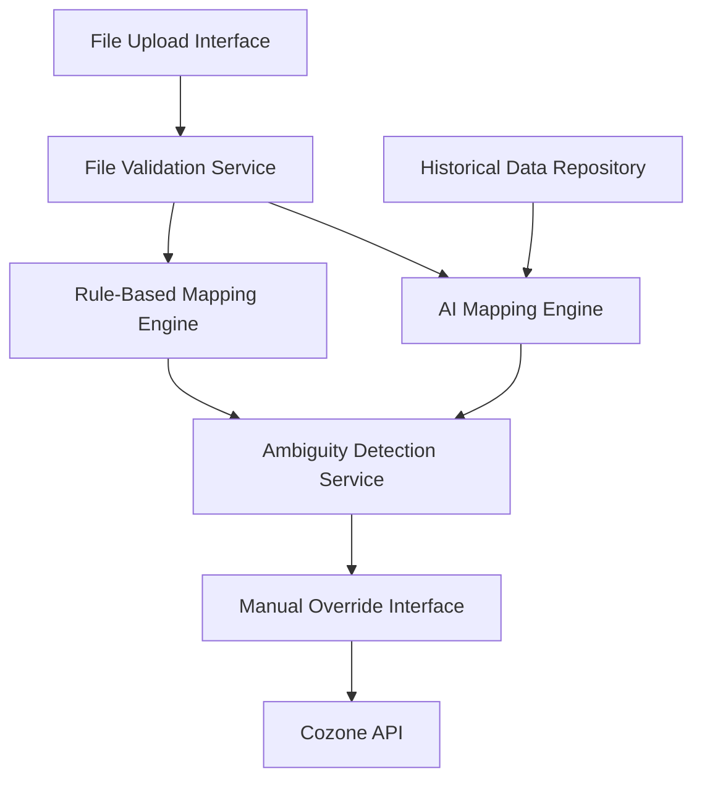

#### 1. High-Level Design

- **Summary**: This epic enables finance teams to upload legacy account structures (CSV, XLSX, XML) from acquired firms and receive AI-driven mapping suggestions to Azets' master ledger. The system uses AI and rule-based algorithms to automatically map accounts, flags ambiguous cases for manual review, allows user overrides, and supports bulk mapping for up to 100 concurrent firms processing 1 million accounts monthly, reducing mapping errors from 15% to under 2% and integration time from 2-4 weeks to under 3 days.

- **Component Flow**:

- **Integration Points**: 
  - Cozone platform API for master ledger structure and validation
  - Historical mapping data repository for AI model training and rule refinement
  - User authentication and access control systems for secure upload and override operations
  - File storage service for uploaded legacy account structures

- **Key Assumptions**: 
  - Legacy account files follow standard tabular formats with identifiable account code and description columns
  - AI model has been pre-trained on historical mapping data and achieves target accuracy (<2% error rate) before production deployment

- **NFR Highlights**: Mapping completes within 60 seconds for up to 10,000 accounts; supports 100 concurrent sessions and 1 million accounts/month; TLS 1.2+ and AES-256 encryption; 99.9% uptime with automated failover

- **Data Flow**: Users upload legacy account files (CSV, XLSX, XML) via File Upload Interface → File Validation Service checks format and data quality → Valid files are processed by both AI Mapping Engine (using Historical Data Repository for context) and Rule-Based Mapping Engine in parallel → Results are merged and analyzed by Ambiguity Detection Service, which flags uncertain mappings → High-confidence mappings are auto-applied; ambiguous cases are presented to users via Manual Override Interface → Users review and approve/override suggestions → Final mappings are pushed to Cozone API for ledger integration. All operations are encrypted and logged.

#### 2. Validation Report

- **Requirements Coverage**: The design fully addresses the epic's scope including legacy account structure upload (CSV, XLSX, XML), AI and rule-based automated mapping, ambiguous mapping flagging, manual override capability, bulk mapping for multiple firms, file format validation, and error notifications. All NFRs are satisfied: 60-second mapping for 10,000 accounts through optimized AI/rule engines, support for 100 concurrent sessions and 1 million accounts/month via scalable architecture, TLS 1.2+ and AES-256 encryption for data security, and 99.9% uptime with failover. Dependencies on Cozone API, historical data repository, and authentication systems are integrated into the component design. The architecture supports the stated business value of reducing errors to <2% and integration time to <3 days.