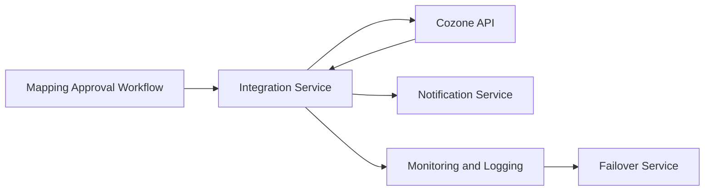

#### 1. High-Level Design

- **Summary**: This epic enables seamless real-time integration with the Azets Cozone platform, automatically pushing approved mapped accounts to the master ledger within 2 minutes. The system eliminates manual ledger entry, ensures data consistency, and includes error handling, notifications, monitoring, and automated failover to maintain 99.9% uptime during critical M&A integration periods.

- **Component Flow**:

- **Integration Points**: 
  - Cozone platform API for ledger updates
  - Cozone authentication and authorization services
  - API versioning support to handle Cozone API changes
  - Monitoring and logging infrastructure for integration health tracking

- **Key Assumptions**: 
  - Cozone API provides synchronous or near-synchronous response for ledger updates within the 2-minute SLA
  - API versioning follows semantic versioning standards with backward compatibility for at least one major version

- **NFR Highlights**: Ledger updates within 2 minutes of approval; 99.9% uptime with automated failover; TLS 1.2+ encryption; API versioning support; GDPR and Azets security policy compliance

- **Data Flow**: Users approve mapped accounts in the Mapping Approval Workflow → Integration Service receives approval event and prepares payload → Service authenticates with Cozone and calls Cozone API to update master ledger → Cozone API returns success/failure response → Integration Service triggers Notification Service to inform users of outcome → All interactions are logged in Monitoring and Logging system. If Cozone API is unavailable, Failover Service queues requests for retry.

#### 2. Validation Report

- **Requirements Coverage**: The design comprehensively addresses the epic's scope including direct Cozone API integration, real-time ledger updates, approval workflow, success/failure notifications, API versioning support, automated failover, and integration monitoring/logging. All NFRs are met: 2-minute update SLA through direct API integration, 99.9% uptime via failover mechanisms, TLS 1.2+ encryption for API communications, API versioning handling, and GDPR/security compliance. Dependencies on Cozone API availability, authentication services, and API documentation are incorporated into the integration architecture.