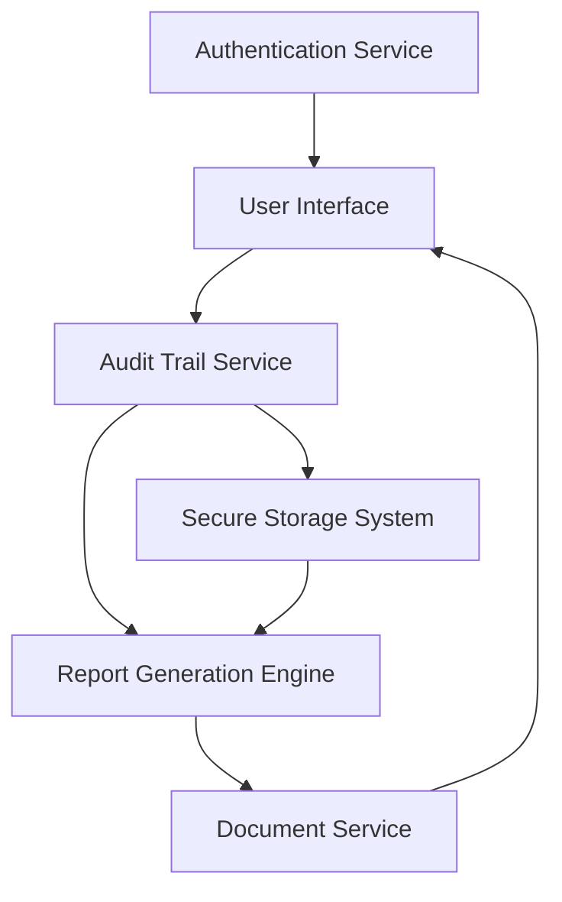

#### 1. High-Level Design

- **Summary**: This epic delivers comprehensive audit-ready reporting capabilities that capture all mapping decisions, manual overrides, timestamps, and user actions throughout the M&A ledger integration process. The system generates downloadable compliance reports in PDF and CSV formats, maintains complete mapping history for 7+ years, and ensures full traceability for regulatory compliance (GDPR, financial reporting standards).

- **Component Flow**:

- **Integration Points**: 
  - Document generation service for PDF/CSV creation
  - Secure storage system for audit trail retention (7+ years)
  - User authentication system for access control and audit logging
  - Role-based access control (RBAC) system for permissions enforcement

- **Key Assumptions**: 
  - Standard PDF/CSV report formats are sufficient for compliance needs; custom templates are not required
  - Audit trail metadata schema includes user ID, timestamp, action type, before/after values, and session ID

- **NFR Highlights**: Reports generated within 30 seconds; 7-year retention with AES-256 encryption; WCAG 2.1 AA accessibility; role-based access controls

- **Data Flow**: Users initiate report requests through the UI → Audit Trail Service retrieves mapping history and metadata from Secure Storage → Report Generation Engine formats data and calls Document Service to create PDF/CSV → Generated reports are returned to users for download. All actions are logged with timestamps, user identity, and context for compliance traceability.

#### 2. Validation Report

- **Requirements Coverage**: The design fully covers the epic's scope including audit-ready report generation (PDF, CSV), mapping history tracking, timestamp logging, manual override documentation, session retrieval, download functionality, compliance metadata capture, and access controls. All NFRs (30-second generation, 7-year retention, AES-256 encryption, WCAG 2.1 AA accessibility, RBAC) are addressed through the component architecture. Dependencies on document generation, secure storage, and authentication services are explicitly integrated into the design.