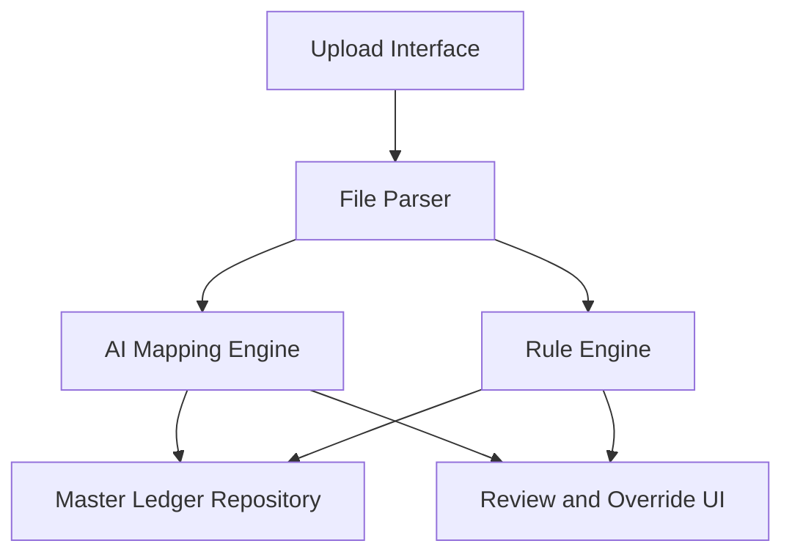

#### 1. High-Level Design

- **Summary**: This epic enables automated mapping of legacy bookkeeping accounts from acquired firms to Azets' master ledger using AI and rule-based algorithms. Users upload legacy account structures in multiple formats (CSV, XLSX, XML), receive intelligent mapping suggestions, and can manually override ambiguous cases. The system flags uncertain mappings for review, reducing mapping errors from 15% to under 2% and accelerating integration timelines from 2-4 weeks to under 3 days.

- **Component Flow**:

- **Integration Points**: 
  - Cozone platform API (downstream) for ledger updates post-mapping
  - Historical mapping data repository for AI model training
  - User file systems for legacy account file uploads
  - Master ledger reference data from Azets Cozone

- **Key Assumptions**: 
  - AI model is pre-trained on historical mapping data and uses similarity algorithms (e.g., NLP-based text matching, decision trees)
  - Confidence threshold (e.g., 80%) determines when mappings are flagged as ambiguous

- **NFR Highlights**: 60-second completion for 10,000 accounts; support 100 concurrent sessions; 1 million accounts/month capacity; TLS 1.2+ and AES-256 encryption; 99.9% uptime with automated failover

- **Data Flow**: User uploads legacy account file (CSV/XLSX/XML) → File Parser extracts account structure → AI Mapping Engine and Rule Engine process accounts against Master Ledger Repository → Confident mappings auto-assigned, ambiguous mappings flagged → Results presented in Review and Override UI → User reviews/overrides → Approved mappings sent to Cozone (via Epic QE-5139). All data encrypted in transit (TLS 1.2+) and at rest (AES-256).

#### 2. Validation Report

- **Requirements Coverage**: The design fully covers legacy account structure upload (CSV, XLSX, XML), AI-driven mapping suggestions, rule-based algorithms, ambiguous mapping flagging, manual override capability, bulk mapping for multiple firms, and error notifications. All stated NFRs (60-second processing for 10K accounts, 100 concurrent sessions, 1M accounts/month, TLS 1.2+/AES-256 encryption, 99.9% uptime) are addressed through scalable architecture and encryption standards. Dependencies on Cozone API, historical mapping data, and user access to legacy files are integrated. Out-of-scope items (non-Azets systems, transaction reconciliation, data cleansing, partner customization) are respected.