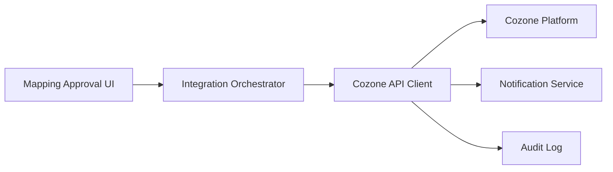

#### 1. High-Level Design

- **Summary**: This epic provides seamless integration with the Azets Cozone platform, enabling direct real-time updates of the master ledger with mapped accounts. Once mapping is finalized and approved, the system automatically synchronizes mapped account codes to Cozone via API, with robust error handling, success/failure notifications, and full traceability for compliance.

- **Component Flow**:

- **Integration Points**: 
  - Cozone platform API (downstream) for ledger updates
  - Cozone API authentication and authorization services
  - Azets master ledger structure and code definitions (reference data)
  - Mapping tool approval workflow (upstream)

- **Key Assumptions**: 
  - Cozone API provides RESTful endpoints with JSON payloads for account updates
  - API versioning is managed via headers or URL path (e.g., /v1/, /v2/)

- **NFR Highlights**: Updates within 2 minutes of approval; TLS 1.2+ encryption; automated failover for API downtime; GDPR and Azets policy compliance

- **Data Flow**: User approves mapping → Integration Orchestrator receives approval event → Cozone API Client formats payload per Cozone schema → API call sent to Cozone Platform via TLS 1.2+ → Cozone returns success/failure → Notification Service alerts user → Audit Log records transaction. Retry logic and failover handle API downtime.

#### 2. Validation Report

- **Requirements Coverage**: The design fully covers direct Cozone API integration, real-time master ledger updates, automated synchronization, success/failure notifications, integration error handling, and ledger update traceability. All stated NFRs (2-minute update window, API versioning handling, automated failover, TLS 1.2+ encryption, GDPR compliance) are addressed. Dependencies on Cozone API availability, authentication, and master ledger structure are explicitly integrated. Out-of-scope items (non-Cozone systems, reverse sync, real-time reconciliation) are respected.