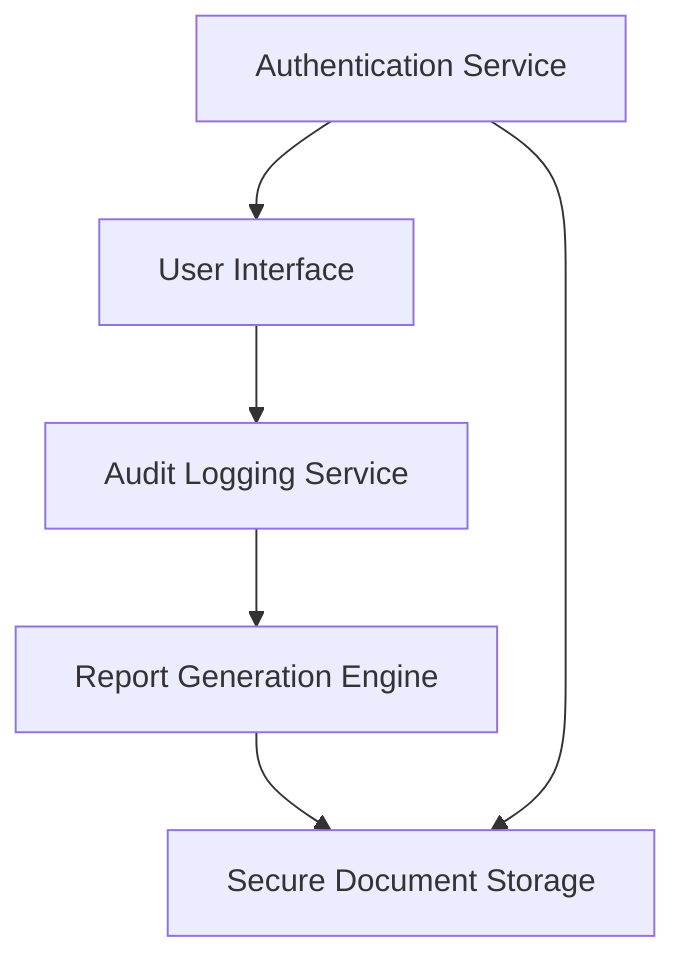

#### 1. High-Level Design

- **Summary**: This epic delivers comprehensive audit-ready reporting capabilities for the HGAzets ledger mapping tool. It captures all mapping decisions, manual overrides, timestamps, and user actions throughout the integration process, enabling users to generate downloadable reports in multiple formats (PDF, CSV) and access complete mapping history for compliance and regulatory requirements (GDPR, Azets policies).

- **Component Flow**:

- **Integration Points**: 
  - Secure document storage system for audit reports
  - User authentication and authorization services for report access
  - Timestamp services for accurate logging
  - Mapping decision engine (upstream) that feeds audit events

- **Key Assumptions**: 
  - Audit logs are stored in a structured format (e.g., JSON or relational database) that supports immutable append-only operations
  - Report generation uses templating engine (e.g., Jasper, Apache POI) for PDF/CSV export

- **NFR Highlights**: Reports generated within 30 seconds; 7-year retention; immutable tamper-proof logs; AES-256 encryption; WCAG 2.1 AA accessibility

- **Data Flow**: User actions (mapping decisions, overrides) → Audit Logging Service captures events with timestamps and metadata → Events stored immutably in Secure Document Storage → User requests report → Report Generation Engine queries audit logs → Generates PDF/CSV → User downloads report. All access controlled via Authentication Service.

#### 2. Validation Report

- **Requirements Coverage**: The design fully covers audit-ready report generation, downloadable formats (PDF, CSV), mapping history access, timestamp logging, manual override documentation, session tracking, and previous report download. All stated NFRs (30-second generation, 7-year retention, immutability, AES-256 encryption, WCAG 2.1 AA) are addressed through component design. Dependencies on secure storage, authentication, and timestamp services are explicitly integrated.