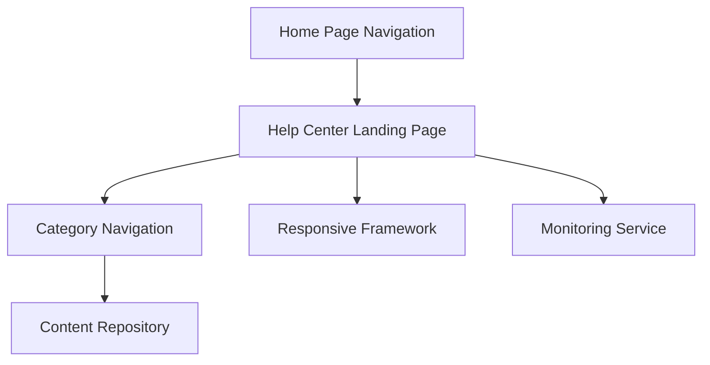

#### 1. High-Level Design

- **Summary:** This epic establishes a comprehensive Help Center accessible from the Home Page main navigation, featuring a dedicated landing page with organized categories (Getting Started, FAQs, How-to Guides, Video Tutorials, Help Materials, Troubleshooting, Chat Support, Search Help). The interface is fully responsive across desktop, tablet, and mobile devices, maintains consistent branding, and meets WCAG 2.1 AA accessibility standards with 2-second page load times and 99.9% uptime.

- **Component Flow:**

- **Integration Points:**
  - Existing website design and branding assets (internal design system)
  - Responsive framework (front-end framework for multi-device support)
  - Documentation and support teams (content providers)
  - Automated monitoring system (uptime and performance tracking)

- **Key Assumptions:**
  - Help Center uses the existing website's responsive framework and design system for consistent branding and device compatibility.
  - Content categories are statically defined but content within categories is dynamically loaded from the Content Repository.

- **NFR Highlights:** Pages and search results load within 2 seconds for 95% of requests; supports 10,000 concurrent users; 99.9% uptime with automated monitoring; WCAG 2.1 AA compliance including keyboard navigation and screen reader support; HTTPS-only delivery.

- **Data Flow:** User clicks Help Center link in Home Page navigation → Help Center Landing Page loads within 2 seconds → User selects category from navigation → Category Navigation component queries Content Repository → Organized content list displayed → User navigates to specific content item. Monitoring Service continuously tracks page load times, uptime, and concurrent user metrics to ensure NFR compliance.

#### 2. Validation Report

- **Requirements Coverage:** The design fully covers all requirements including prominent Help Center entry point on Home Page, dedicated landing page, organized categories (8 specified categories), responsive design across all devices (desktop, tablet, mobile), branding consistency, WCAG 2.1 AA accessibility compliance, 2-second page load time for 95% of requests, support for 10,000 concurrent users, 99.9% uptime with monitoring, and HTTPS delivery. Dependencies on existing website assets, responsive framework, and documentation teams are incorporated. Out-of-scope items (live human chat, content creation, ticketing integration, analytics dashboard) are correctly excluded. Expected business outcomes (20% reduction in support tickets, 30% Help Center access rate) are noted as success metrics.