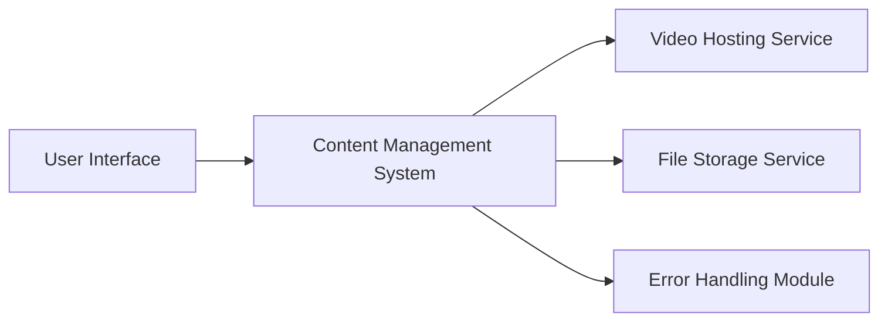

#### 1. High-Level Design

- **Summary:** This epic delivers comprehensive help content capabilities including text articles, FAQs, embedded video tutorials with in-page playback, and downloadable materials (user guides, PDFs, training documents). Content is organized by categories with robust error handling that displays meaningful messages and alternative actions when resources are unavailable. All content is accessible through category browsing with automated link checking.

- **Component Flow:**

- **Integration Points:**
  - Video hosting infrastructure (internal/CDN)
  - File storage and download services (cloud storage or internal file server)
  - Content management system (CMS for content organization and retrieval)
  - Documentation and support teams (content providers)

- **Key Assumptions:**
  - Video files are hosted on a CDN or dedicated video platform with embed support and standard playback controls.
  - Downloadable materials are stored in a secure file storage service with direct download links generated on-demand.

- **NFR Highlights:** Video playback and downloads load within 2 seconds; all materials served over HTTPS; graceful handling of unavailable resources with fallback messaging; automated link checking to prevent broken links.

- **Data Flow:** User browses categories → Content Management System retrieves content metadata → For videos: Video Hosting Service streams content with playback controls embedded in page → For downloads: File Storage Service generates secure download link → User downloads material over HTTPS. Error scenarios: When resource unavailable → Error Handling Module displays meaningful message with alternative actions → User redirected to related content or category.

#### 2. Validation Report

- **Requirements Coverage:** The design addresses all requirements including text articles, FAQs, embedded video tutorials with playback controls, downloadable materials (PDFs, guides), meaningful error messages with alternative actions, category-based content filtering, 2-second load time for video/downloads, HTTPS delivery, and graceful error handling with automated link checking. Dependencies on documentation teams, video hosting, file storage, and CMS are acknowledged. Out-of-scope items (content creation, user-generated content, versioning, multilingual support) are correctly excluded.