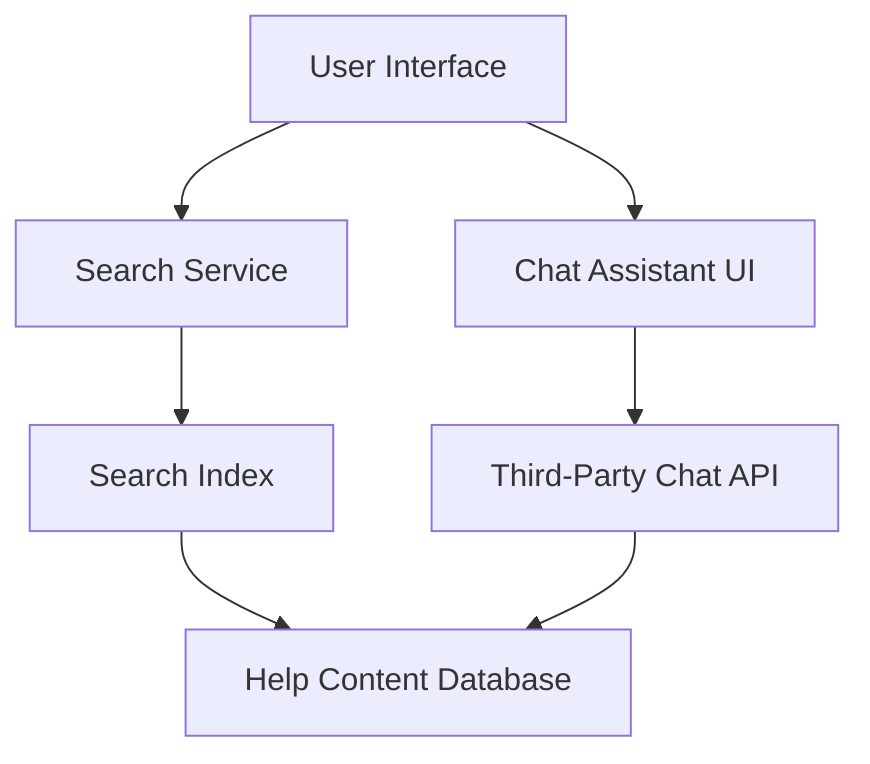

#### 1. High-Level Design

- **Summary:** This epic implements intelligent search functionality across all help content types (articles, videos, FAQs, downloadable materials) with keyword-based indexing, returning results within 2 seconds. It also provides an interactive chat assistant accessible from the Help Center that opens within 2 seconds, enabling real-time conversational support with message exchange and automatic linking to relevant help articles while maintaining security compliance.

- **Component Flow:**

- **Integration Points:**
  - Third-party chat assistant API (external service integration)
  - Search indexing service (internal/external)
  - Existing help content database (internal data source)
  - HTTPS endpoints for secure communication

- **Key Assumptions:**
  - Search indexing is performed asynchronously and kept up-to-date with content changes via scheduled jobs or event-driven updates.
  - Third-party chat API provides webhook or REST endpoints for real-time messaging and returns article recommendations based on query matching.

- **NFR Highlights:** Search results load within 2 seconds for 95% of requests; chat assistant opens within 2 seconds; supports 10,000 concurrent users; HTTPS-only communication; WCAG 2.1 AA accessibility compliance; no sensitive user data exposure in chat.

- **Data Flow:** User enters search keywords → Search Service queries Search Index → Index returns ranked results from Help Content Database → Results displayed to user within 2 seconds. For chat: User opens chat assistant → Chat UI connects to Third-Party Chat API → User sends message → API processes query and retrieves relevant articles from Help Content Database → Response with article links returned to user in real-time over HTTPS.

#### 2. Validation Report

- **Requirements Coverage:** The design covers all stated requirements including keyword search with 2-second response time, search indexing of all content types, organized results display, interactive chat assistant with 2-second load time, real-time messaging, chat-to-article linking, security compliance (HTTPS, no sensitive data exposure), mobile optimization, and accessibility standards. The architecture supports 10,000 concurrent users and integrates with third-party chat API as specified. Out-of-scope items (live human chat, ticketing integration, AI recommendations, chat history persistence) are correctly excluded.