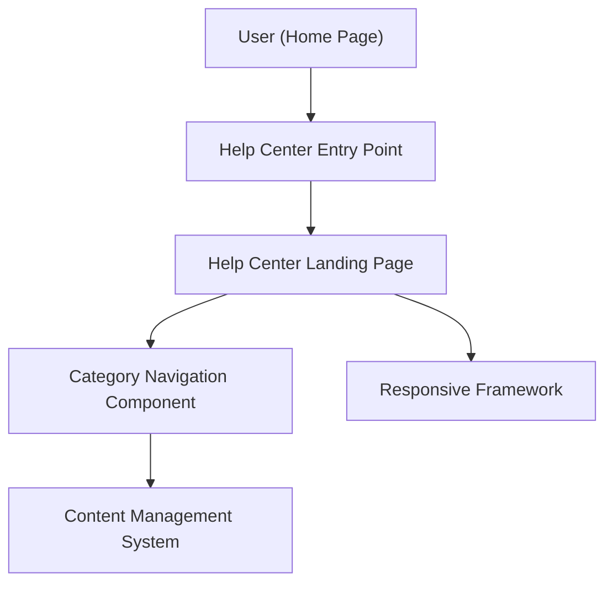

#### 1. High-Level Design

- **Summary**: Enable users to access a dedicated Help Center from the Home Page with organized categories (Getting Started, FAQs, How-to Guides, Video Tutorials, Help Materials, Troubleshooting, Chat Support, Search Help), responsive design across devices, and branding/accessibility compliance. The system supports 10,000 concurrent users with 99.9% uptime and 2-second page load times.

- **Component Flow**:

- **Integration Points**: 
  - Existing website design and branding assets for visual consistency
  - Responsive framework for cross-device compatibility (desktop, tablet, mobile)
  - Content Management System for organized help content delivery
  - Documentation and support teams for content provision
  - Monitoring system for 99.9% uptime tracking

- **Key Assumptions**: 
  - Help Center uses existing responsive framework already deployed on the website
  - Category structure is static or infrequently updated, allowing for efficient caching to meet 2-second load requirement

- **NFR Highlights**: Pages load within 2 seconds for 95% of requests; supports 10,000 concurrent users; WCAG 2.1 AA compliant with keyboard navigation and screen reader support; 99.9% uptime with automated monitoring

- **Data Flow**: User clicks Help Center entry point on Home Page → System loads Help Center landing page with category navigation → User selects category (e.g., FAQs, Video Tutorials) → Category navigation component retrieves organized content from Content Management System → Content displayed with responsive framework adapting to device type → Fallback messaging shown if resources unavailable → User navigates between categories or returns to Home Page

#### 2. Validation Report

- **Requirements Coverage**: The design fully addresses the epic's requirements including Help Center entry point on Home Page, dedicated landing page, categorized content organization, responsive design across all devices, branding and accessibility compliance, category navigation, and fallback messaging. Performance (2-second load, 10,000 concurrent users), accessibility (WCAG 2.1 AA), and uptime (99.9%) NFRs are incorporated. Dependencies on branding assets, responsive framework, and content teams are acknowledged. Out-of-scope items (live chat, content creation, external ticketing, analytics dashboard) are excluded.