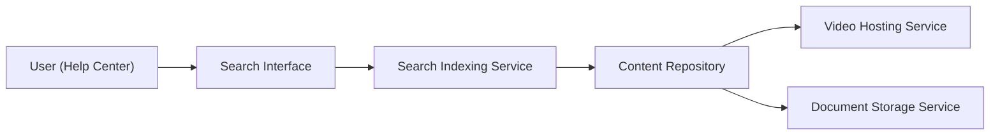

#### 1. High-Level Design

- **Summary**: Provide powerful search and content browsing capabilities within the Help Center, enabling users to search by keywords and access text articles, FAQs, embedded video tutorials, and downloadable materials. Search results return within 2 seconds with all content served over HTTPS.

- **Component Flow**:

- **Integration Points**: 
  - Search indexing service for keyword-based content retrieval
  - Content repository containing help articles, FAQs, and metadata
  - Video hosting infrastructure for embedded tutorial playback
  - Document storage and delivery systems for downloadable materials (PDFs, guides)
  - Documentation and support teams as content providers

- **Key Assumptions**: 
  - Content repository is pre-indexed with metadata tags to enable sub-2-second search performance
  - Video formats are standardized (e.g., MP4, WebM) and compatible with HTML5 playback controls

- **NFR Highlights**: Search results load within 2 seconds for 95% of requests; HTTPS for all downloads; standard video playback controls; handles concurrent downloads without degradation

- **Data Flow**: User enters search keywords → Search interface queries search indexing service → Service retrieves matching content from content repository → Results displayed with links to articles, videos, and downloads → User selects content type (article/video/download) → Content served from respective service (video hosting or document storage) → Error messages displayed if resources unavailable with alternative suggestions

#### 2. Validation Report

- **Requirements Coverage**: The design covers all specified requirements including keyword search with indexing, text articles and FAQs, embedded video tutorials with playback, downloadable materials, meaningful error messaging, and 2-second search performance. Dependencies on content providers, video hosting, document storage, and search indexing are addressed. Out-of-scope items (user feedback, bookmarking, content creation, analytics) are excluded as specified.