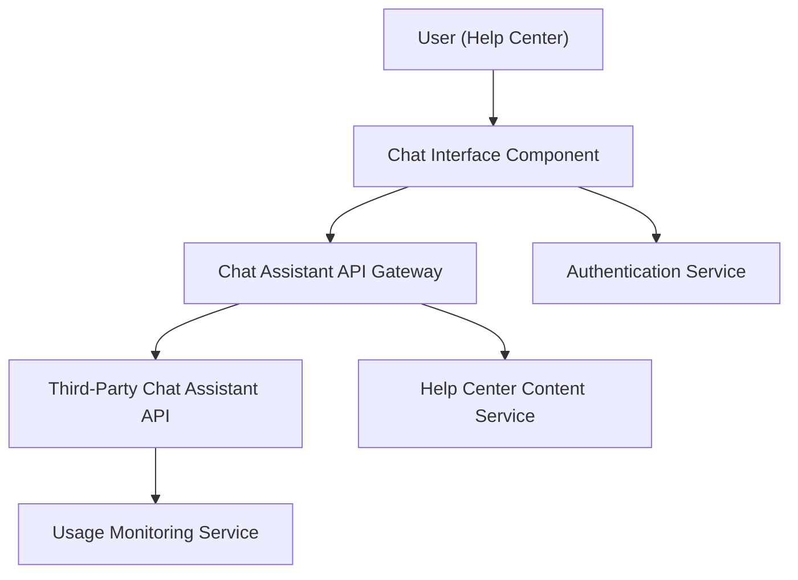

#### 1. High-Level Design

- **Summary**: Deliver an interactive chat assistant integrated with the Help Center that provides real-time help to users, opening within 2 seconds and enabling secure message exchange over HTTPS. The assistant suggests relevant help articles based on queries and supports up to 10,000 concurrent sessions while meeting WCAG 2.1 AA accessibility standards.

- **Component Flow**:

- **Integration Points**: 
  - Third-party chat assistant API for message processing and response generation
  - Existing authentication and user management systems for secure user identification
  - Help Center content service for contextual article suggestions
  - Usage monitoring system for support staff analytics

- **Key Assumptions**: 
  - Third-party chat API provides sub-second response times to meet the 2-second window activation requirement
  - Chat session state is managed server-side with session tokens for concurrent user support

- **NFR Highlights**: Chat window opens within 2 seconds; supports 10,000 concurrent sessions; HTTPS-only; WCAG 2.1 AA compliant; no sensitive data exposure

- **Data Flow**: User activates chat from Help Center → Chat interface authenticates user via authentication service → User query sent to Chat Assistant API Gateway → API forwards to third-party chat assistant → Assistant processes query and optionally retrieves relevant articles from Help Center content service → Response returned to user via chat interface → Interaction logged to usage monitoring service for support staff analysis

#### 2. Validation Report

- **Requirements Coverage**: The design addresses all core requirements including real-time messaging, 2-second activation, HTTPS security, contextual help article suggestions, concurrent session support, accessibility compliance, and usage monitoring. Integration with third-party chat API, authentication systems, and Help Center content is accounted for. Out-of-scope items (live human support, external ticketing, advanced AI, multilingual support) are explicitly excluded.