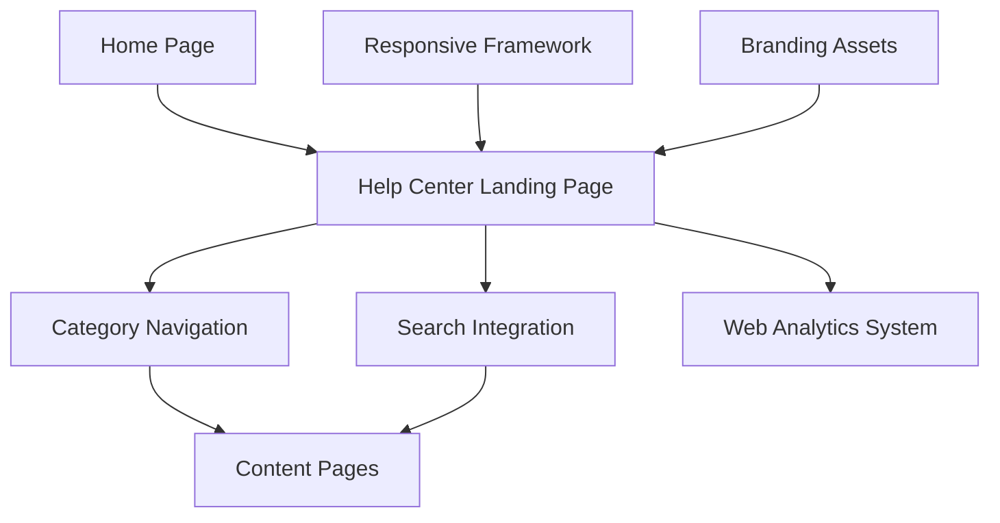

#### 1. High-Level Design

- **Summary**: This epic establishes a comprehensive Help Center accessible from the Home Page through a prominent navigation entry point. The Help Center landing page organizes support content into logical categories (Getting Started, FAQs, How-to Guides, Video Tutorials, Help Materials, Troubleshooting, Chat Support, Search Help). The design is fully responsive across desktop, tablet, and mobile devices, maintains brand consistency, meets WCAG 2.1 AA accessibility standards, and supports seamless navigation between categories with integrated search functionality. The system supports 10,000 concurrent users with 99.9% uptime and 2-second page load times.

- **Component Flow**:

- **Integration Points**: 
  - Existing website design and branding assets for visual consistency
  - Responsive framework for cross-device compatibility
  - Web analytics tracking system for measuring Help Center access rates and usage patterns
  - Search functionality integration (from Epic QE-5173)
  - Content delivery system (from Epic QE-5172)

- **Key Assumptions**: 
  - Category taxonomy is predefined and stable; no dynamic category creation required
  - Branding assets (CSS, logos, fonts) are centrally managed and accessible via existing framework

- **NFR Highlights**: Pages and search results load within 2 seconds for 95% of requests; supports 10,000 concurrent users; WCAG 2.1 AA compliance with keyboard navigation and screen reader support; 99.9% uptime with automated monitoring; HTTPS for all content

- **Data Flow**: User accesses Home Page → Clicks Help Center entry point → Help Center Landing Page loads from server with category structure → User selects category via Category Navigation → Content Pages load filtered content within 2 seconds. Alternatively: User uses Search Integration → Search results displayed (handled by Epic QE-5173). All user interactions tracked by Web Analytics System for access rates and usage pattern analysis. Responsive Framework ensures proper rendering across desktop, tablet, and mobile devices. Branding Assets applied consistently across all Help Center pages.

#### 2. Validation Report

- **Requirements Coverage**: The design comprehensively covers the epic's scope including Help Center entry point on Home Page, dedicated landing page, categorized content organization (Getting Started, FAQs, How-to Guides, Video Tutorials, Help Materials, Troubleshooting, Chat Support, Search Help), responsive design across all devices, branding/accessibility compliance, navigation between categories, search functionality integration, and mobile-optimized interface. All NFRs are satisfied: 2-second page load times for 95% of requests, 10,000 concurrent user support, WCAG 2.1 AA compliance with keyboard navigation and screen reader support, 99.9% uptime with automated monitoring, and HTTPS for all content. Dependencies on existing website design/branding assets, responsive framework compatibility, and web analytics tracking system are incorporated. Out-of-scope items (live human chat support, analytics dashboard for support staff, external ticketing integration, content creation) are explicitly excluded.