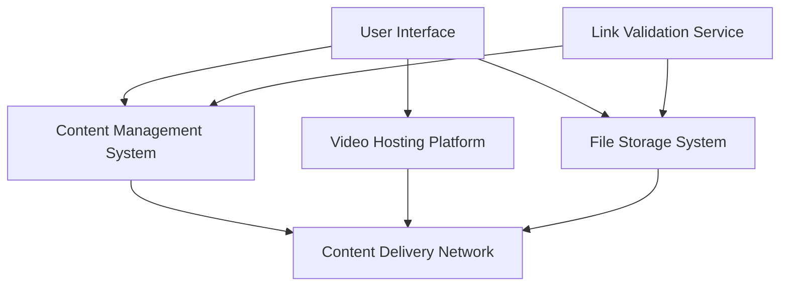

#### 1. High-Level Design

- **Summary**: This epic provides multi-format help content delivery including text-based articles, FAQs, embedded video tutorials with playback controls, and downloadable materials (user guides, PDFs, quick reference guides). Users can browse content by category and popularity, view recently accessed topics, play videos directly within the Help Center, and download materials for offline access. The system provides meaningful error messages when resources are unavailable and supports up to 10,000 concurrent users with WCAG 2.1 AA accessibility compliance.

- **Component Flow**:

- **Integration Points**: 
  - Content Management System (CMS) for organizing and serving articles, FAQs, and materials
  - Video hosting platform for embedded tutorials with playback controls
  - File storage system for downloadable materials (PDFs, guides)
  - Documentation and support teams for content availability
  - Automated link checking service to prevent broken resource links

- **Key Assumptions**: 
  - Video captions/transcripts are provided by content creators and stored with video metadata
  - Downloaded files are versioned externally; users always receive the latest published version

- **NFR Highlights**: Video playback initiates within 2 seconds; HTTPS for all downloads; WCAG 2.1 AA compliance including video captions; supports 10,000 concurrent downloads; automated link checking for resource availability

- **Data Flow**: User browses categories → Content Management System retrieves filtered content list → User selects article/FAQ → CMS serves text content via CDN. For videos: User clicks video → Video Hosting Platform streams content via CDN → Playback initiates within 2 seconds with captions available. For downloads: User clicks download link → File Storage System serves file over HTTPS via CDN → File downloaded to user device. Link Validation Service continuously checks CMS and File Storage for broken links and triggers error messaging when resources are unavailable.

#### 2. Validation Report

- **Requirements Coverage**: The design fully addresses the epic's scope including text-based articles/FAQs, embedded video tutorials with playback controls, downloadable materials, meaningful error messaging, content filtering by category/popularity, and recently viewed/popular topics display. All NFRs are met: 2-second video playback initiation, HTTPS for downloads, WCAG 2.1 AA compliance with video captions, 10,000 concurrent user support, and automated link checking. Dependencies on content availability from documentation/support teams, CMS, video hosting platform, and file storage system are incorporated. Out-of-scope items (content creation, user-generated content, version control, translation/localization) are explicitly excluded.