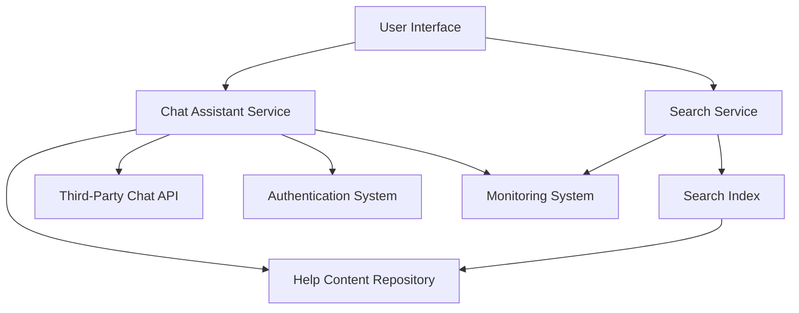

#### 1. High-Level Design

- **Summary**: This epic delivers self-service support capabilities through a keyword-based search engine that indexes all help content types (articles, videos, FAQs, downloadables) and an interactive chat assistant for real-time help. The search returns relevant results within 2 seconds, and the chat assistant provides immediate responses with context-aware article recommendations. Both features are fully responsive, accessible (WCAG 2.1 AA), and support up to 10,000 concurrent users with 99.9% uptime.

- **Component Flow**:

- **Integration Points**: 
  - Third-party chat assistant API for conversational intelligence
  - Search indexing service for content aggregation
  - Existing website authentication system for personalized chat sessions
  - Monitoring system for usage tracking and performance metrics
  - Help content repository (articles, videos, FAQs, downloadables)

- **Key Assumptions**: 
  - Search index is updated in near-real-time or on a scheduled basis to reflect new/updated content
  - Chat assistant API supports session-based context retention during active user sessions

- **NFR Highlights**: Search results load within 2 seconds for 95% of requests; chat window opens within 2 seconds; supports 10,000 concurrent users; 99.9% uptime; WCAG 2.1 AA compliant; HTTPS-only; no sensitive user data exposure in chat

- **Data Flow**: User enters search query → Search Service queries Search Index → Index returns ranked results from Help Content Repository → Results displayed to user within 2 seconds. For chat: User sends message → Chat Assistant Service authenticates via Authentication System → Request forwarded to Third-Party Chat API → API processes query and suggests relevant articles from Help Content Repository → Response returned to user. All interactions logged to Monitoring System for analytics.

#### 2. Validation Report

- **Requirements Coverage**: The design fully covers the epic's stated scope including keyword-based search across all content types, search ranking/relevance, interactive chat with real-time messaging, chat integration with help article recommendations, accessibility features, mobile optimization, and fallback messaging. All NFRs (2-second response times, 10,000 concurrent users, WCAG 2.1 AA, 99.9% uptime, HTTPS) are addressed through the architecture. Dependencies on third-party chat API, search indexing service, authentication system, and monitoring system are incorporated. Out-of-scope items (live human chat, ticketing integration, persistent chat history, multilingual support, voice interaction) are explicitly excluded.