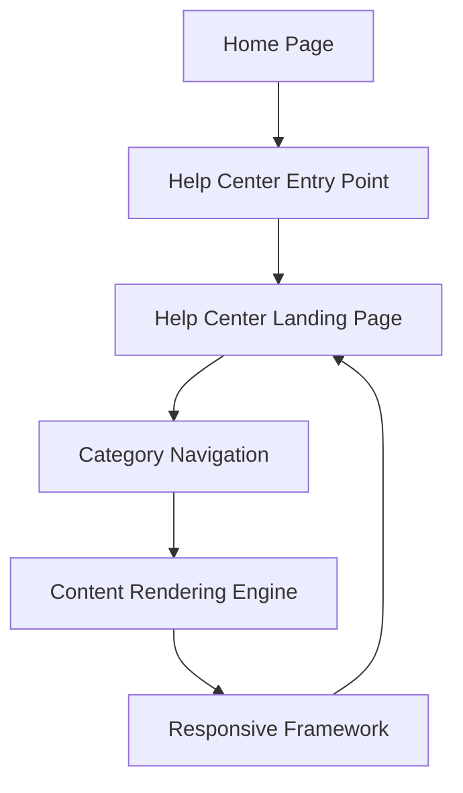

#### 1. High-Level Design

- **Summary**: This epic creates a dedicated Help Center accessible from the Home Page with a prominent navigation entry point leading to a landing page organized into logical categories (Getting Started, FAQs, How-to Guides, Video Tutorials, Help Materials, Troubleshooting, Chat Support, Search Help). The solution provides browse/filter capabilities, maintains responsive design across all devices, ensures WCAG 2.1 AA accessibility compliance, and preserves the existing Home Page layout.

- **Component Flow**:

- **Integration Points**: 
  - Existing website design and branding assets for visual consistency
  - Responsive framework for cross-device compatibility (desktop/tablet/mobile)
  - Help content repository from documentation and support teams
  - Accessibility testing tools for WCAG 2.1 AA validation

- **Key Assumptions**: 
  - The existing responsive framework supports the required device breakpoints without major refactoring
  - Help content is already available in a structured format compatible with the category taxonomy

- **NFR Highlights**: Pages load within 2 seconds for 95% of requests; supports 10,000 concurrent users; 99.9% uptime; WCAG 2.1 AA compliant (keyboard navigation, screen reader support)

- **Data Flow**: User navigates to Home Page → Clicks Help Center entry point in main navigation → Help Center Landing Page loads within 2 seconds → Page displays eight content categories with visual branding → User selects category → Category Navigation filters and displays relevant content → Content Rendering Engine applies Responsive Framework for device-appropriate display → Browse/filter controls allow further refinement → Accessibility features (keyboard navigation, ARIA labels, screen reader support) active throughout

#### 2. Validation Report

- **Requirements Coverage**: The design fully addresses the Help Center entry point on Home Page, dedicated landing page, categorized content organization (8 categories as specified), browse/filter functionality, responsive design for all devices, visual branding alignment, and WCAG 2.1 AA accessibility compliance. All NFRs are architecturally supported: 2-second page load (via optimized rendering), 10K concurrent user capacity (scalable infrastructure), 99.9% uptime (standard web hosting SLA), and accessibility standards (built into responsive framework and content rendering). Dependencies on existing design assets, responsive framework, and help content availability are incorporated into the component flow.