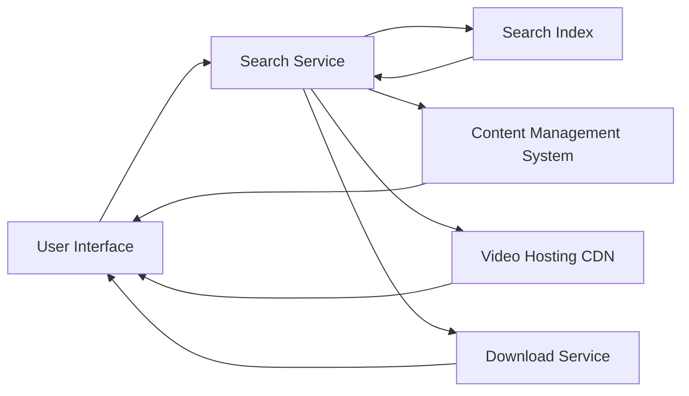

#### 1. High-Level Design

- **Summary**: This epic provides comprehensive search functionality across all help content types (articles, videos, downloadable materials) with results loading within 2 seconds. Users can consume content in multiple formats including text articles/FAQs, embedded video tutorials with playback controls, and downloadable PDFs/guides. The system displays meaningful error messages with alternatives when resources are unavailable.

- **Component Flow**:

- **Integration Points**: 
  - Content Management System (CMS) for storing and serving help articles and FAQs
  - Video hosting service or CDN for embedded tutorial delivery
  - Search indexing service for fast keyword-based content discovery
  - Existing website content delivery infrastructure for HTTPS-secured downloads

- **Key Assumptions**: 
  - Search indexing service supports real-time or near-real-time updates when new content is published
  - Video formats are standardized (e.g., MP4, WebM) and compatible with HTML5 video players

- **NFR Highlights**: Search results load within 2 seconds for 95% of requests; HTTPS for all downloads; standard web video format support; handles 10,000 concurrent downloads

- **Data Flow**: User enters search keywords → Search Service queries Search Index → Index returns matching content metadata (articles, videos, materials) → Results displayed in UI within 2 seconds → User selects content type: (a) Text article retrieved from CMS and rendered, (b) Video streamed from CDN with playback controls, or (c) Material downloaded via Download Service over HTTPS → Error handler displays meaningful message with alternatives if resource unavailable

#### 2. Validation Report

- **Requirements Coverage**: The design comprehensively covers keyword search functionality, text-based articles/FAQs, embedded video tutorials with controls, downloadable materials (guides/PDFs), and error messaging with alternatives. All NFRs are addressed: 2-second search results (via indexed search), HTTPS downloads (via Download Service), standard video format support (HTML5-compatible CDN), and 10K concurrent download capacity. Dependencies on CMS, video hosting/CDN, search indexing, and content delivery infrastructure are integrated into the architecture.