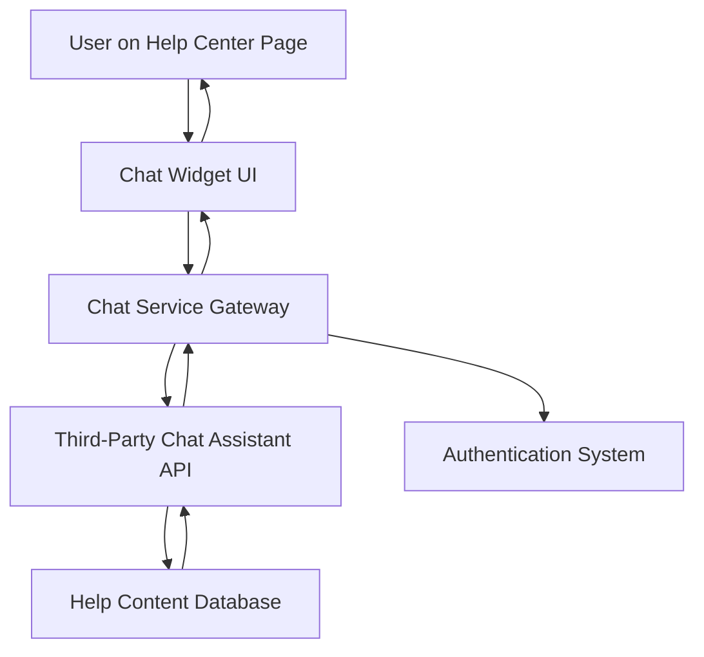

#### 1. High-Level Design

- **Summary**: This epic delivers an interactive chat assistant integrated into the Help Center landing page, providing real-time automated support with intelligent article recommendations. The chat opens within 2 seconds, maintains secure HTTPS communication, supports up to 10,000 concurrent sessions, and includes fallback messaging for service unavailability.

- **Component Flow**:

- **Integration Points**: 
  - Third-party chat assistant API for natural language processing and response generation
  - Existing authentication system for user context and session management
  - Help content database for intelligent article recommendations
  - Monitoring system for uptime tracking and concurrent session management

- **Key Assumptions**: 
  - The third-party chat API supports webhook or REST-based integration for real-time messaging
  - User authentication tokens can be passed securely to provide personalized context without exposing sensitive data

- **NFR Highlights**: Chat window opens within 2 seconds; HTTPS-only communication; no sensitive data exposure; 99.9% uptime; supports 10,000 concurrent sessions

- **Data Flow**: User activates chat widget → Chat UI sends user query via HTTPS to Chat Service Gateway → Gateway authenticates user context → Query forwarded to Third-Party Chat Assistant API → API analyzes query and retrieves relevant help articles from Help Content Database → Response with article links returned through Gateway → Chat UI displays automated response to user → Fallback message displayed if service unavailable

#### 2. Validation Report

- **Requirements Coverage**: The design fully addresses the epic's scope including interactive chat widget, real-time messaging, intelligent article linking, responsive interface, chat activation/management, and fallback messaging. All NFRs (2-second load, HTTPS, data security, 99.9% uptime, 10K concurrent sessions) are architecturally supported through the gateway pattern and third-party API integration. Dependencies on authentication, help content database, and secure protocols are incorporated into the component flow.