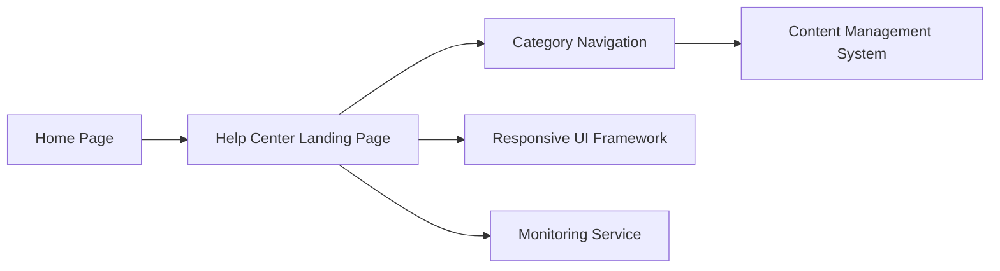

#### 1. High-Level Design

- **Summary**: This epic enables users to access a dedicated Help Center from the Home Page with organized categories, intuitive navigation, and responsive design. Users can browse help articles, FAQs, and troubleshooting guides organized into logical categories (Getting Started, How-to Guides, Troubleshooting). The Help Center landing page serves as a centralized hub with clear visual hierarchy, seamless branding integration, and WCAG 2.1 AA accessibility compliance.

- **Component Flow**:

- **Integration Points**: 
  - Existing website design and branding assets for consistent visual identity
  - Responsive framework for multi-device compatibility (desktop/tablet/mobile)
  - Content Management System from documentation and support teams for help articles and FAQs
  - Automated monitoring service for 99.9% uptime tracking

- **Key Assumptions**: 
  - Responsive framework (e.g., Bootstrap, Material UI) is already in use or compatible with existing website stack
  - Content is structured with metadata (categories, tags) enabling logical organization and navigation

- **NFR Highlights**: Pages load within 2 seconds (95% requests); Support 10,000 concurrent users; 99.9% uptime with automated monitoring; WCAG 2.1 AA compliance (keyboard navigation, screen reader support); HTTPS for all content

- **Data Flow**: User clicks Help Center link on Home Page → Help Center Landing Page loads from web server → Category Navigation component displays organized content categories → User selects category → Content Management System retrieves relevant articles/FAQs → Content rendered through Responsive UI Framework → Monitoring Service tracks page load times and uptime. Error handling displays meaningful messages for unavailable resources.

#### 2. Validation Report

- **Requirements Coverage**: The design covers all stated requirements including Help Center entry point on Home Page, dedicated landing page, categorized content organization (Getting Started, How-to Guides, Troubleshooting), text-based articles and FAQs, responsive design for all devices, WCAG 2.1 AA compliance with keyboard navigation and screen reader support, branding integration, meaningful error messaging, 2-second page load time (95%), 10,000 concurrent user support, 99.9% uptime, and HTTPS delivery. Dependencies on existing branding assets and responsive framework are addressed.