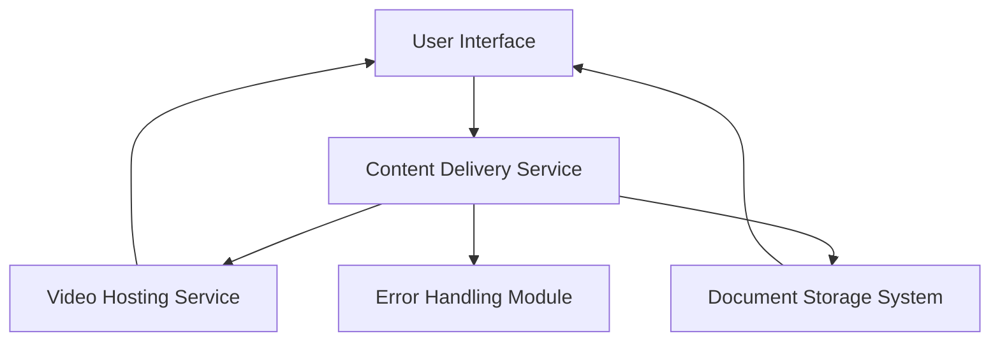

#### 1. High-Level Design

- **Summary**: This epic provides rich multimedia learning experiences through embedded video tutorials with playback controls and downloadable help materials (user guides, PDFs, training documents). Videos play directly within the Help Center without external navigation, and materials are available for offline download. The system handles unavailable resources gracefully with error messages and alternative suggestions.

- **Component Flow**:

- **Integration Points**: 
  - Third-party video hosting/streaming service for video content delivery and playback
  - Document storage and delivery system for downloadable materials (guides, PDFs, training docs)
  - Content management system from documentation and support teams for content availability

- **Key Assumptions**: 
  - Video hosting service provides embeddable player with standard playback controls and supports adaptive streaming
  - Document storage system supports concurrent downloads with CDN distribution for scalability

- **NFR Highlights**: Video playback initiates within 2 seconds; HTTPS for all content delivery; Support 10,000 concurrent downloads; Proper error handling for failed downloads

- **Data Flow**: User requests video → Content Delivery Service retrieves video URL from Video Hosting Service → Embedded player loads in UI with 2-second initiation. For downloads: User requests document → Content Delivery Service fetches from Document Storage System → File streamed to user over HTTPS. Error Handling Module intercepts failures and provides meaningful messages with alternative suggestions.

#### 2. Validation Report

- **Requirements Coverage**: The design covers all stated requirements including embedded video tutorials with playback controls, downloadable materials (user guides, quick reference guides, FAQs, PDFs, training documents), graceful error handling with meaningful messages and alternatives, 2-second video playback initiation, HTTPS delivery, and support for 10,000 concurrent users. Integration with third-party video hosting and document storage systems is addressed.