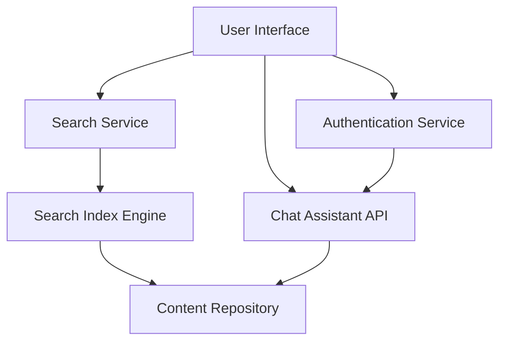

#### 1. High-Level Design

- **Summary**: This epic delivers self-service capabilities through keyword-based search functionality and an interactive chat assistant. Users can search help content (articles, videos, materials) with results loading within 2 seconds, and interact with a real-time chat assistant that provides answers and links to relevant help articles. Both features are accessible across all devices and integrated into the Help Center.

- **Component Flow**:

- **Integration Points**: 
  - Third-party chat assistant API for real-time messaging and query processing
  - Search indexing service/engine for content indexing and retrieval
  - Existing website authentication system for secure chat sessions
  - Content Repository for help articles, videos, and materials

- **Key Assumptions**: 
  - Search index is pre-built and maintained by a separate indexing service with near real-time updates
  - Chat assistant API supports REST/WebSocket protocols and can handle contextual queries with article linking capabilities

- **NFR Highlights**: Search results load within 2 seconds (95% requests); Chat window opens within 2 seconds; HTTPS for all interactions; Support 10,000 concurrent sessions; No sensitive user data exposure in chat

- **Data Flow**: User submits search query → Search Service queries Search Index Engine → Engine retrieves ranked results from Content Repository → Results displayed to user. For chat: User sends message → Chat Assistant API processes query → API retrieves relevant articles from Content Repository → Response with links returned to user. Authentication Service validates user session before enabling chat.

#### 2. Validation Report

- **Requirements Coverage**: The design covers all stated requirements including keyword search with 2-second response time, interactive chat assistant with real-time messaging, integration with third-party chat API, search indexing across all content types, relevance ranking, multi-device accessibility, and security requirements (HTTPS, no sensitive data exposure). The architecture supports 10,000 concurrent sessions as specified in NFRs.