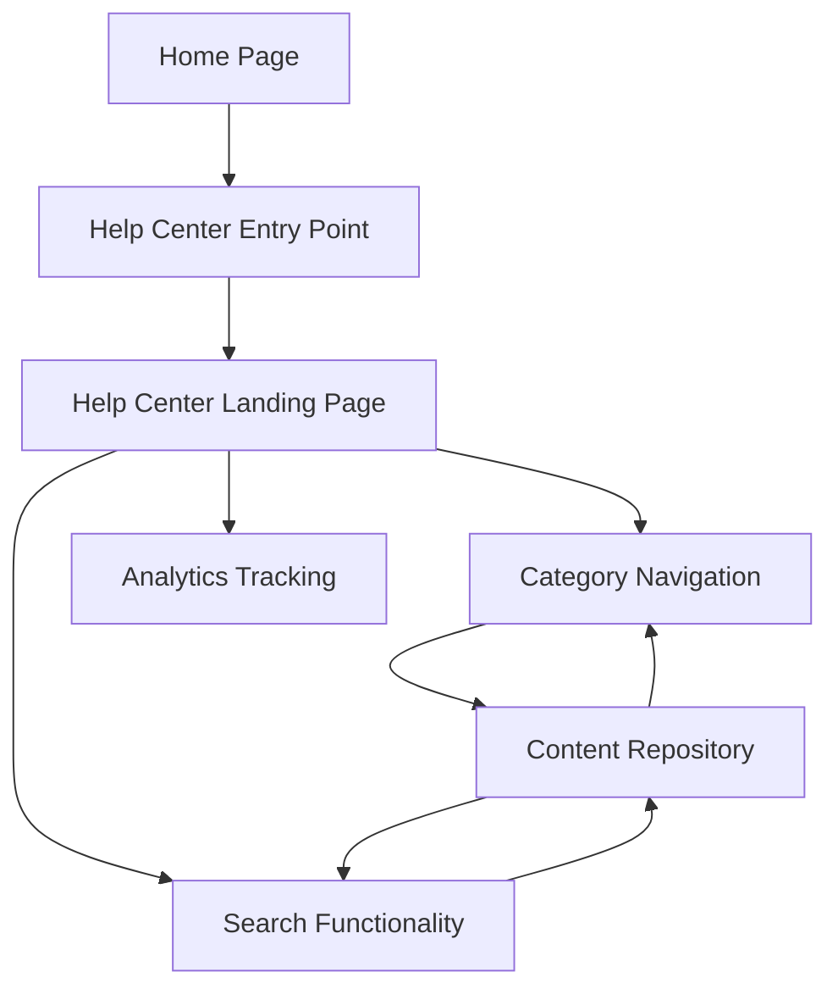

#### 1. High-Level Design

- **Summary:** This epic establishes a Help Center accessible from the Home Page main navigation, featuring a landing page with categorized content (Getting Started, FAQs, How-to Guides, Video Tutorials, Help Materials, Troubleshooting, Chat Support, Search Help), keyword search, responsive design, and WCAG 2.1 AA accessibility compliance.

- **Component Flow:**

- **Integration Points:** 
  - Existing website design and branding assets for consistent UI/UX
  - Responsive framework (e.g., Bootstrap, Tailwind) for cross-device compatibility
  - Web analytics tracking system (e.g., Google Analytics, Adobe Analytics) to measure Help Center access rates and user behavior
  - Content repository/CMS for serving categorized help content

- **Key Assumptions:** 
  - The Help Center entry point is added to the main navigation without displacing existing menu items; responsive framework is already in use on the Home Page.
  - Search functionality uses keyword matching against content metadata (titles, tags, descriptions); no advanced NLP or semantic search is required.

- **NFR Highlights:** Help Center pages and search results must load within 2 seconds for 95% of requests; support 10,000 concurrent users; WCAG 2.1 AA compliance (keyboard navigation, screen reader support); 99.9% uptime with automated monitoring.

- **Data Flow:** User on Home Page clicks Help Center entry point → Help Center landing page loads with categorized content sections → User either browses categories or enters search keywords → If browsing, category navigation queries content repository for category-specific items → If searching, search functionality queries content repository using keywords → Results displayed to user → User navigates to specific content → Analytics tracking logs user interactions for monitoring access rates.

#### 2. Validation Report

- **Requirements Coverage:** The design addresses all requirements: Help Center entry point on Home Page, dedicated landing page with 8 content categories, keyword search, responsive design for desktop/tablet/mobile, branding consistency, WCAG 2.1 AA accessibility, 2-second load time target, 10,000 concurrent user support, and 99.9% uptime. Out-of-scope items (live human chat, content creation, external ticketing integration, analytics dashboard for support staff) are excluded from the design.