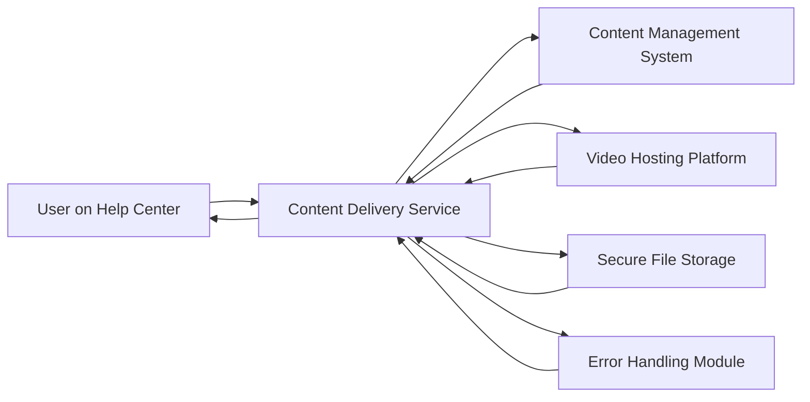

#### 1. High-Level Design

- **Summary:** This epic enables the Help Center to deliver diverse content formats including text articles, FAQs, embedded video tutorials, and downloadable materials (PDFs, guides). Content must load within 2 seconds for 95% of requests, be served securely over HTTPS, and include graceful error handling for unavailable resources.

- **Component Flow:**

- **Integration Points:** 
  - Content Management System (CMS) for organizing and serving text articles and FAQs
  - Video hosting platform (e.g., Vimeo, YouTube, or internal CDN) for embedded video tutorials
  - Secure file storage (e.g., S3, Azure Blob) for downloadable materials (PDFs, guides)
  - Automated link checker to validate resource availability

- **Key Assumptions:** 
  - Content is pre-authored and uploaded to CMS, video platform, and file storage by documentation/support teams; content delivery service acts as an aggregator.
  - Video hosting platform supports HTTPS streaming and standard playback controls; bandwidth optimization for mobile is handled by the platform.

- **NFR Highlights:** All content must load within 2 seconds for 95% of requests; HTTPS for all content delivery; video playback optimized for mobile bandwidth; automated link checking to prevent broken links.

- **Data Flow:** User navigates to help article/video/download → Content delivery service receives request → Service queries CMS for articles, video platform for video URLs, or file storage for download links → If resource unavailable, error handling module returns fallback message with alternative actions → Content or error message returned to user → User views article, plays video, or downloads material.

#### 2. Validation Report

- **Requirements Coverage:** The design covers all requirements: text articles, FAQs, embedded videos with playback controls, downloadable materials, secure HTTPS delivery, 2-second load time target, error handling with fallback messaging, and mobile optimization. Out-of-scope items (content creation, live streaming, user-generated content, version control) are not included in the design.