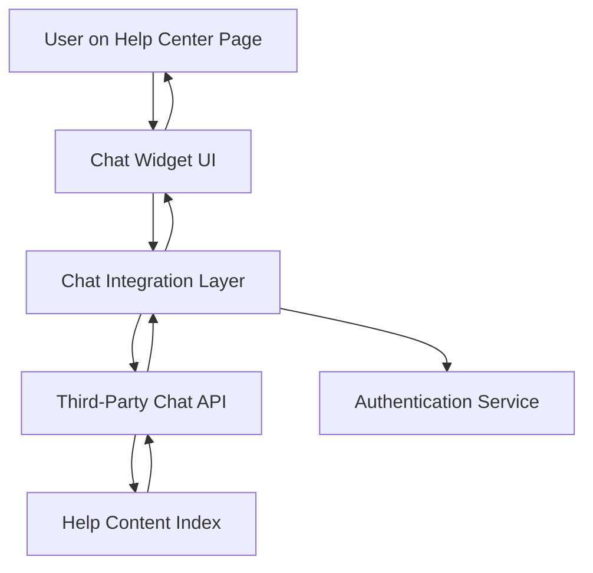

#### 1. High-Level Design

- **Summary:** This epic delivers an interactive chat assistant integrated into the Help Center landing page, enabling real-time automated support for common user questions. The chat assistant must load within 2 seconds, support secure message exchange, and optionally link users to relevant help articles based on their queries.

- **Component Flow:**

- **Integration Points:** 
  - Third-party chat assistant API for conversational logic and response generation
  - Existing authentication system to provide user context securely
  - Help content index to retrieve and suggest relevant article links based on user queries

- **Key Assumptions:** 
  - The third-party chat API provides a JavaScript SDK or REST API for integration; chat sessions are stateless and do not persist across page reloads.
  - User context (e.g., logged-in status, user ID) is passed securely to the chat API without exposing PII in client-side code.

- **NFR Highlights:** Chat assistant must open within 2 seconds; support 10,000 concurrent sessions; all interactions over HTTPS; 99.9% uptime; no exposure of sensitive user data.

- **Data Flow:** User clicks chat widget → Chat UI loads and authenticates user via authentication service → User sends message → Message routed through integration layer to third-party chat API → API processes query, optionally queries help content index for relevant articles → Response returned to integration layer → Chat UI displays response and any suggested article links to user.

#### 2. Validation Report

- **Requirements Coverage:** The design addresses all stated requirements: real-time chat interaction, 2-second load time, secure HTTPS communication, concurrent session support (10,000), integration with authentication and help content index, and responsive UI for mobile/desktop. Out-of-scope items (live human chat, ticket creation, chat history persistence, multilingual support, sentiment analysis) are explicitly excluded and not designed.