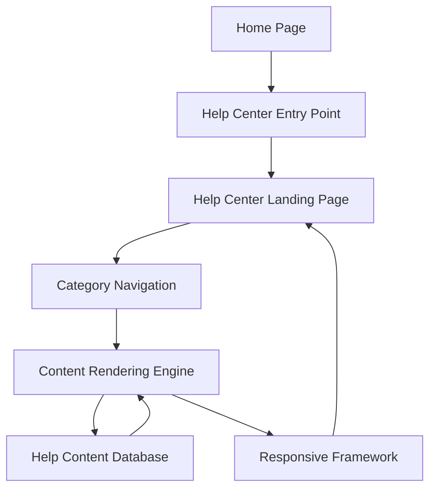

#### 1. High-Level Design

- **Summary**: Establish a comprehensive Help Center accessible from the Home Page via a prominent entry point, featuring a dedicated landing page with organized categories (Getting Started, FAQs, How-to Guides, Video Tutorials, Help Materials, Troubleshooting, Chat Support, Search Help). The implementation ensures responsive design across all devices, 2-second page load times for 95% of requests, WCAG 2.1 AA accessibility compliance, and visual alignment with existing website branding.

- **Component Flow**:

- **Integration Points**: 
  - Existing Home Page layout and functionality for entry point placement
  - Help content database containing articles, FAQs, and categorized resources
  - Responsive framework for cross-device compatibility (desktop, tablet, mobile)
  - Website design and branding assets for visual consistency
  - Content management system used by documentation and support teams
  - Accessibility infrastructure for WCAG 2.1 AA compliance

- **Key Assumptions**: 
  - Help content is pre-organized and tagged by category in the content database for efficient retrieval and display
  - The responsive framework supports adaptive layouts and component rendering across device breakpoints without custom development

- **NFR Highlights**: 2-second page load time for 95% of requests; 10,000 concurrent users without performance degradation; 99.9% uptime with automated monitoring; WCAG 2.1 AA compliance including keyboard navigation and screen reader support; HTTPS for all content

- **Data Flow**: User navigates to Home Page → Clicks Help Center entry point → Request routed to Help Center landing page → Category navigation component loads from content database → Content rendering engine retrieves categorized content metadata → Responsive framework adapts layout based on device type → Landing page displays with organized categories within 2 seconds. User selects category → Content rendering engine fetches relevant articles/FAQs from help content database → Content displayed with accessible markup and meaningful error messages for unavailable resources.

#### 2. Validation Report

- **Requirements Coverage**: The design fully satisfies the epic scope including Help Center entry point on Home Page, dedicated landing page, categorized content organization (8 categories specified), text-based articles and FAQs, responsive design for all devices, branding and WCAG 2.1 AA compliance, and meaningful error messaging. All NFRs are addressed: 2-second load time through optimized content rendering, 10,000 concurrent user support via scalable architecture, 99.9% uptime with monitoring, full WCAG 2.1 AA accessibility including keyboard navigation and screen reader support, and HTTPS-secured content delivery. Dependencies on existing website design, responsive framework, help content availability, and Home Page layout are explicitly incorporated into the component architecture and data flow.