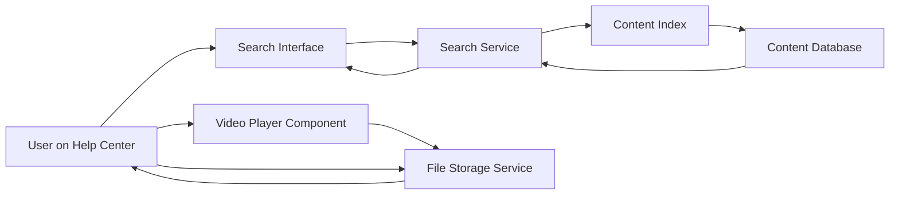

#### 1. High-Level Design

- **Summary**: Deliver comprehensive content discovery through keyword-based search functionality that indexes all help content types (articles, videos, downloadable materials) with 2-second result loading, embedded video tutorials with in-page playback, and downloadable help materials (user guides, PDFs, FAQs, training documents) served over HTTPS. The solution supports 10,000 concurrent users with 99.9% uptime and integrates with categorized content structure.

- **Component Flow**:

- **Integration Points**: 
  - Search indexing service for content aggregation and query processing
  - Video hosting infrastructure or embedded player compatibility (e.g., HTML5 video, third-party video CDN)
  - File storage and delivery system for downloadable materials
  - Help Center content database containing articles, videos, and documents
  - Existing website responsive framework for cross-device functionality
  - Content management system for documentation and support teams

- **Key Assumptions**: 
  - Search indexing service supports full-text search across multiple content types with relevance ranking
  - Video files are stored in standard web formats (MP4, WebM) compatible with HTML5 video players or served via CDN with embed support

- **NFR Highlights**: Search results 2-second load time for 95% of requests; standard web video format support; HTTPS for all downloads; full content indexing; 10,000 concurrent users; 99.9% uptime

- **Data Flow**: User enters search keywords → Search interface sends query to search service → Search service queries content index → Content index retrieves matching results from content database (articles, videos, documents) → Results returned and displayed within 2 seconds with filtering options. For video playback: User clicks video → Video player component streams from file storage service → Video plays in-page without navigation. For downloads: User requests download → File storage service validates availability → File served over HTTPS to user's device.

#### 2. Validation Report

- **Requirements Coverage**: The design comprehensively addresses all epic requirements including keyword search across all content types, 2-second search result loading, embedded video playback, downloadable materials with HTTPS delivery, content filtering capabilities, and responsive functionality. All NFRs are satisfied through the architecture: search service optimized for 2-second response time, video player supporting standard web formats, HTTPS-secured file delivery, comprehensive content indexing, scalability for 10,000 concurrent users, and 99.9% uptime through redundant services. Dependencies on help content, video infrastructure, file storage, search indexing, and responsive framework are explicitly incorporated into the component design.