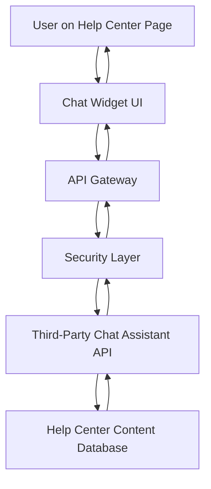

#### 1. High-Level Design

- **Summary**: Implement a real-time interactive chat assistant accessible from the Help Center landing page that provides instant answers to user questions, links to relevant help articles, and enables bidirectional messaging. The solution must open within 2 seconds, support 10,000 concurrent users, maintain 99.9% uptime, and ensure secure HTTPS communication without exposing sensitive user data.

- **Component Flow**:

- **Integration Points**: 
  - Third-party chat assistant API (external service provider)
  - Help Center content database for article linking and context retrieval
  - Existing website security protocols and HTTPS infrastructure
  - Responsive framework for mobile chat functionality
  - Help Center interface for widget embedding

- **Key Assumptions**: 
  - The third-party chat assistant API provides natural language processing capabilities and returns structured responses with article links
  - Chat session data is ephemeral and not persisted beyond the current session (as chat history persistence is out of scope)

- **NFR Highlights**: Chat window 2-second load time; HTTPS-only; no sensitive data exposure; 10,000 concurrent users; 99.9% uptime; WCAG 2.1 AA accessibility compliance

- **Data Flow**: User initiates chat from Help Center → Chat widget sends query via API Gateway → Security layer validates and sanitizes request → Third-party chat API processes query using NLP → API queries Help Center content database for relevant articles → Response with answers and article links flows back through security layer → Chat widget displays response to user with bidirectional messaging capability maintained throughout session.

#### 2. Validation Report

- **Requirements Coverage**: The design fully covers the epic's scope including chat assistant accessibility, 2-second activation, bidirectional messaging, article linking, real-time responses, secure interactions, and Help Center integration. All NFRs (performance, security, scalability, uptime, accessibility) are addressed through the architecture with API Gateway for load distribution, security layer for data protection, and third-party API integration for chat functionality. Dependencies on third-party API, security protocols, content database, and responsive framework are incorporated into the component flow.