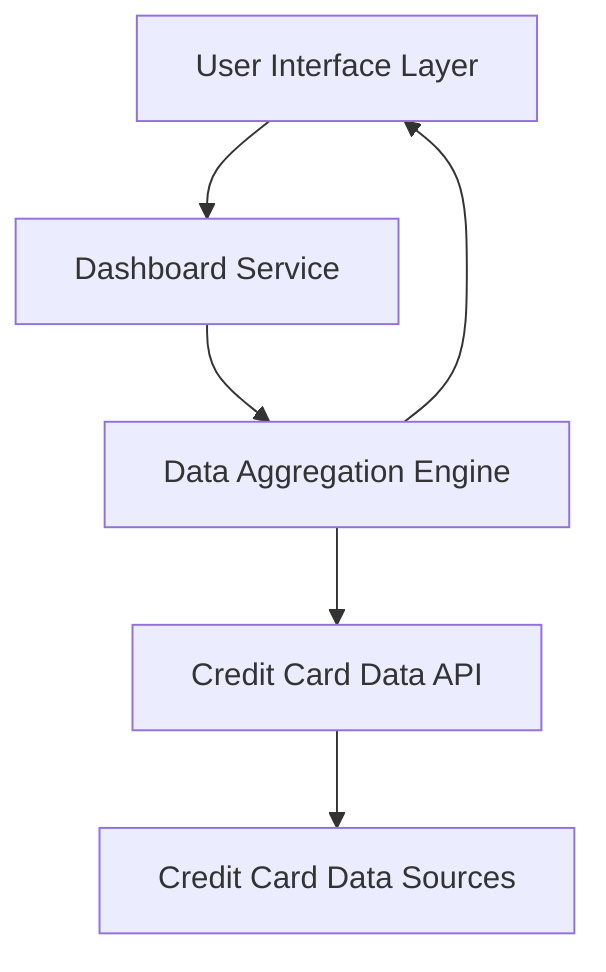

#### 1. High-Level Design

- **Summary:** This epic delivers a consolidated dashboard that displays all user credit cards with key financial metrics (monthly spend, total credit limit, available credit, outstanding amounts) in a single responsive interface, enabling users to monitor their overall credit card portfolio and financial health.

- **Component Flow:**

- **Integration Points:** 
  - Credit card data sources for retrieving card details, balances, and credit limits
  - Data aggregation service for consolidating multi-card financial metrics

- **Key Assumptions:** 
  - Credit card data is available via RESTful API with real-time or near-real-time updates
  - Available credit is calculated as (Total Credit Limit - Outstanding Amount) on the backend

- **NFR Highlights:** System must support responsive layouts across desktop, tablet, and mobile devices; Dashboard load time must be optimized for quick access to financial data

#### 2. Validation Report

- **Requirements Coverage:** The design covers all stated scope items including dashboard view, monthly spend display, total credit limit display, available credit calculation, outstanding amount tracking, multiple credit card management, and responsive layout design. The component flow addresses integration with credit card data sources and provides a clear separation between UI, business logic, and data layers.

- **Gap Analysis:** No significant gaps identified. The epic clearly defines scope and excludes real bank integration, payments, and transfers which are appropriately marked as out of scope.

- **Risk Assessment:** 
  - **Medium Risk:** Performance optimization for dashboard load times may require caching strategies and efficient data aggregation
  - **Low Risk:** Responsive design implementation is well-understood with established frameworks available

- **Compliance Considerations:** Standard data security practices required for displaying financial information; no PCI-DSS compliance needed as payment processing is out of scope