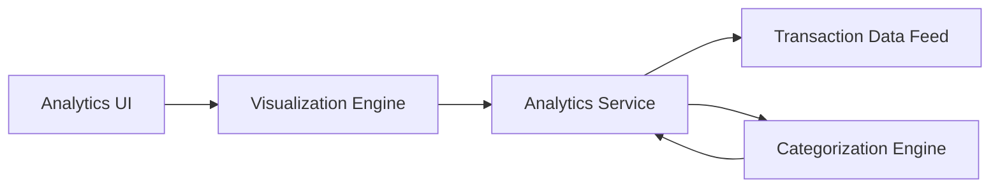

#### 1. High-Level Design

- **Summary:** This epic provides interactive visualizations and analytics for users to understand spending patterns through category-wise analysis (9 categories: Food & Dining, Fuel, Shopping, Travel, Entertainment, Utilities, Healthcare, Education, Miscellaneous), monthly spend trends, and card-wise spend comparison across multiple credit cards.

- **Component Flow:**

- **Integration Points:** 
  - Transaction data feeds for raw transaction information
  - Categorization engine for automatic classification of transactions into spending categories
  - Charting/visualization library for rendering interactive graphs

- **Key Assumptions:** 
  - Transactions are pre-categorized by the categorization engine or include merchant category codes (MCC) for classification
  - Analytics data is aggregated and stored in a format optimized for query performance (e.g., monthly/category rollups)

- **NFR Highlights:** Analytics visualizations must render within acceptable performance thresholds; System must handle data aggregation for multiple cards and categories efficiently

#### 2. Validation Report

- **Requirements Coverage:** The design addresses all scope elements including category-wise spending visualization, monthly spend trends analysis, card-wise spend analysis, interactive charts and graphs, spending pattern identification, and multi-category support for all 9 specified categories. The architecture supports efficient data aggregation and visualization rendering.

- **Gap Analysis:** No critical gaps. The epic clearly defines the 9 spending categories and visualization requirements. Out of scope items (predictive analytics, budget recommendations) are appropriately excluded.

- **Risk Assessment:** 
  - **Medium Risk:** Performance of data aggregation for large transaction volumes across multiple cards and categories requires optimization
  - **Low Risk:** Interactive visualization implementation using established charting libraries (e.g., Chart.js, D3.js)

- **Compliance Considerations:** Analytics must maintain data privacy; aggregated spending insights should not expose sensitive transaction details beyond what's necessary for the visualization