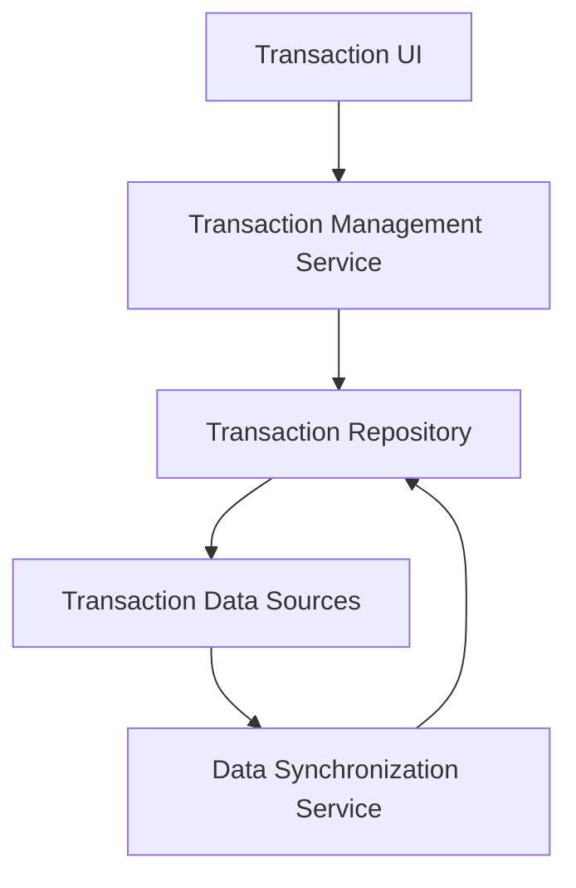

#### 1. High-Level Design

- **Summary:** This epic enables users to view and manage credit card transactions across all their cards, providing access to detailed transaction information, purchase history, and complete visibility into financial activities with support for large transaction volumes.

- **Component Flow:**

- **Integration Points:** 
  - Transaction data sources for retrieving and synchronizing transaction records
  - Data repository/database for storing and querying transaction history
  - Potential integration with the categorization engine (from Epic QE-5220) for transaction classification

- **Key Assumptions:** 
  - Transaction data is synchronized periodically from external sources with eventual consistency acceptable
  - Transaction listing supports pagination and filtering to handle large volumes efficiently

- **NFR Highlights:** Transaction data must be displayed accurately and consistently; System must handle large transaction volumes efficiently

#### 2. Validation Report

- **Requirements Coverage:** The design covers all scope items including transaction listing, transaction details view, multi-card transaction support, and transaction history access. The architecture supports efficient handling of large transaction volumes through proper data management and synchronization patterns.

- **Gap Analysis:** No significant gaps identified. The epic appropriately excludes transaction disputes, payment processing, fund transfers, and transaction editing/deletion from scope, maintaining focus on view-only transaction management.

- **Risk Assessment:** 
  - **Medium Risk:** Handling large transaction volumes efficiently requires proper indexing, pagination, and query optimization strategies
  - **Low Risk:** Transaction display and detail views are standard UI patterns with established implementation approaches

- **Compliance Considerations:** Transaction data display must ensure data accuracy and consistency; read-only access reduces security risks associated with transaction modification