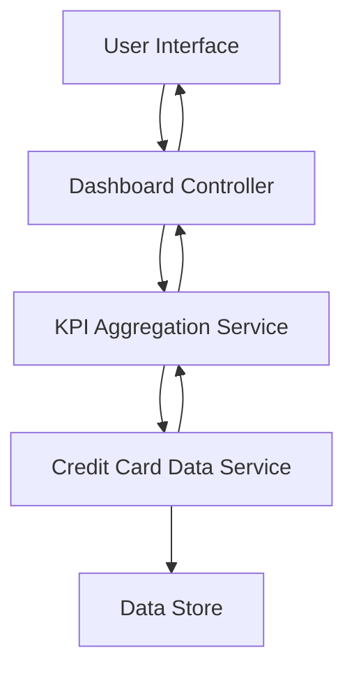

#### 1. High-Level Design

**Summary:** This epic delivers a consolidated dashboard that displays key performance indicators (KPIs) for multiple credit cards, including monthly spend, total credit limit, available credit, and outstanding amounts. The dashboard provides real-time visibility into the user's credit card portfolio through a modern, responsive interface.

**Component Flow:**

**Integration Points:**
- Credit card data source or mock data service for retrieving card details, balances, and transaction information
- Backend API for KPI calculation and aggregation
- Responsive UI framework for cross-device rendering

**Key Assumptions:**
- Data refresh occurs in real-time or near real-time (within the 2-second load requirement)
- KPI calculations (available credit, utilization) are performed server-side and cached appropriately

**NFR Highlights:** Dashboard must load within 2 seconds; System must support responsive design across desktop, tablet, and mobile devices; UI must be modern and intuitive following current design standards

#### 2. Validation Report

**Requirements Coverage:** The design covers all stated scope items including KPI display, monthly spend tracking, credit limit aggregation, available credit calculation, outstanding amount monitoring, multiple credit card view, and responsive layout. The component flow ensures data flows from storage through aggregation services to the UI layer, meeting the 2-second load requirement through appropriate caching and optimization strategies.

**Completeness Check:** All functional requirements are addressed. NFRs for performance (2-second load), responsiveness (multi-device support), and usability (modern UI) are incorporated into the architecture. Integration dependencies with credit card data services are identified and accounted for in the design.

**Risk Assessment:** Primary risks include data latency from upstream services potentially impacting the 2-second load requirement, and the need for efficient aggregation algorithms when handling multiple credit cards. Mitigation strategies include implementing caching layers and optimizing database queries.