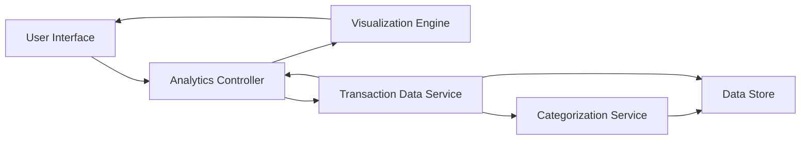

#### 1. High-Level Design

**Summary:** This epic provides interactive analytics and visualization capabilities for users to understand spending patterns through category-wise analysis (9 predefined categories) and monthly trend tracking. It includes card-wise spend analysis and historical spending comparison to help users optimize credit card usage.

**Component Flow:**

**Integration Points:**
- Transaction data service for historical spending records (minimum 12 months)
- Categorization engine or service to classify transactions into predefined categories (Food & Dining, Fuel, Shopping, Travel, Entertainment, Utilities, Healthcare, Education, Miscellaneous)
- Interactive charting library for visualization rendering

**Key Assumptions:**
- Transaction categorization is performed automatically by the categorization service with high accuracy
- Historical data for 12 months is readily available and pre-aggregated for performance

**NFR Highlights:** Visualizations must render within 1 second of data load; Charts must be interactive and support drill-down capabilities; System must handle at least 12 months of historical transaction data

#### 2. Validation Report

**Requirements Coverage:** The design addresses all scope items including category-wise spending visualization, monthly spend trend analysis, card-wise spend breakdown, interactive charts, nine predefined spending categories, and historical spending comparison. The architecture separates concerns between data retrieval, categorization, and visualization rendering to meet the 1-second rendering requirement.

**Completeness Check:** All functional requirements are covered. NFRs for performance (1-second render time), interactivity (drill-down support), and data volume (12 months history) are incorporated. Dependencies on transaction data service and categorization engine are identified and integrated into the component flow.

**Risk Assessment:** Key risks include performance degradation when processing large transaction datasets and potential inaccuracy in automatic categorization. Mitigation includes implementing data aggregation strategies, caching frequently accessed analytics, and ensuring the categorization service has high accuracy rates.