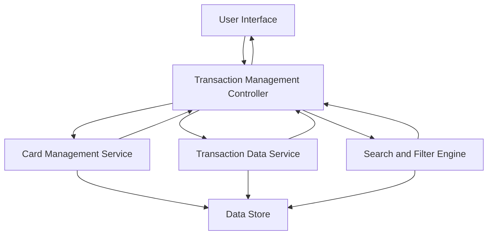

#### 1. High-Level Design

**Summary:** This epic enables users to manage multiple credit cards (up to 10 per user) and view associated transactions with detailed information including merchant, amount, date, and category. It provides comprehensive transaction management capabilities including listing, viewing, filtering, searching, and sorting across the credit card portfolio.

**Component Flow:**

**Integration Points:**
- Transaction data service for retrieving and storing transaction records
- Credit card management service for card details and metadata
- Search and filter engine for query operations (must complete within 500ms)
- Pagination service for handling large transaction datasets

**Key Assumptions:**
- Transaction data is stored in an indexed database optimized for search and filter operations
- Pagination is implemented server-side to handle large datasets efficiently without client-side performance impact

**NFR Highlights:** System must support management of at least 10 credit cards per user; Transaction list must support pagination for large datasets; Search and filter operations must complete within 500ms

#### 2. Validation Report

**Requirements Coverage:** The design covers all stated scope including multiple credit card management, transaction listing and viewing, transaction details display, card-specific transaction filtering, transaction search and sorting, and transaction categorization display. The architecture separates card management from transaction operations while ensuring efficient search and filter capabilities.

**Completeness Check:** All functional requirements are addressed. NFRs for capacity (10 cards per user), scalability (pagination support), and performance (500ms search/filter) are incorporated into the design. Dependencies on transaction data service and card management service are identified and integrated.

**Risk Assessment:** Primary risks include search and filter performance degradation with large transaction volumes and potential scalability issues as users approach the 10-card limit with extensive transaction histories. Mitigation strategies include database indexing, query optimization, efficient pagination implementation, and caching frequently accessed transaction data.