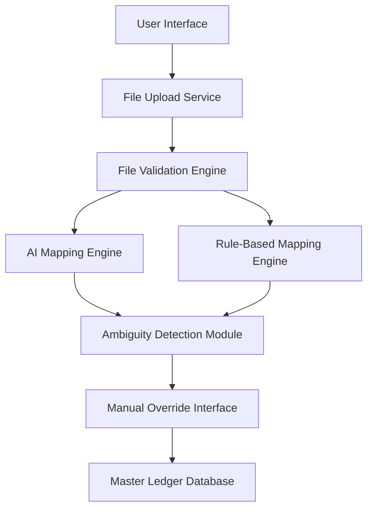

#### 1. High-Level Design

- **Summary**: This epic enables finance and accounting teams to upload legacy account structures from acquired firms (CSV, XLSX, XML formats) and receive AI-driven mapping suggestions to Azets' master ledger. The system uses AI and rule-based algorithms to automatically map account codes, flags ambiguous mappings for manual review, and allows user overrides to ensure accuracy. This reduces manual effort, minimizes mapping errors from 15% to under 2%, and accelerates integration timelines from 2-4 weeks to under 3 days.

- **Component Flow**:

- **Integration Points**: 
  - Cozone platform API for ledger updates
  - Historical mapping data repository for AI model training
  - Legacy account file sources from acquired firms

- **Key Assumptions**: 
  - Legacy account files are provided in standardized CSV, XLSX, or XML formats with consistent column headers
  - Historical mapping data is sufficient for AI model training and accuracy targets

- **NFR Highlights**: Mapping operations must complete within 60 seconds for uploads up to 10,000 accounts; System must support concurrent mapping sessions for up to 100 firms; Process up to 1 million accounts per month; All data transfers encrypted using TLS 1.2+ and AES-256; GDPR compliance required; System uptime 99.9% monthly with automated failover

#### 2. Validation Report

- **Requirements Coverage**: The design covers all stated scope including file upload (CSV, XLSX, XML), AI and rule-based automated mapping, ambiguous mapping flagging, manual override capability, bulk mapping for multiple firms, error notifications for failed mappings, and file format validation. All NFRs are addressed including performance (60-second completion), scalability (100 concurrent firms, 1M accounts/month), security (TLS 1.2+, AES-256), GDPR compliance, and availability (99.9% uptime with automated failover).

- **Gap Analysis**: No significant gaps identified. The epic clearly defines scope, user value, NFRs, dependencies, and out-of-scope items. Integration with Cozone is appropriately listed as a dependency and covered in a separate epic (QE-5226).

- **Risk Assessment**: 
  - AI model accuracy dependency on quality and volume of historical mapping data
  - Complexity of handling diverse legacy account structures from multiple acquired firms
  - Performance risk for concurrent processing of 100 firms with large account volumes

- **Compliance Validation**: GDPR compliance explicitly required; TLS 1.2+ and AES-256 encryption specified; meets enterprise security standards for data transfer and storage.