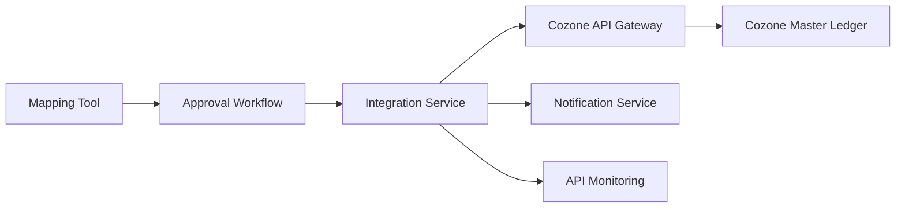

#### 1. High-Level Design

- **Summary**: This epic provides seamless integration between the automated mapping tool and Azets' Cozone platform, enabling direct updates of the master ledger with mapped accounts. Once mapping is finalized and approved by users, the system automatically pushes mapped account codes to Cozone in real-time, eliminating manual ledger entry and ensuring data consistency across systems. The integration includes success/error notifications, API versioning support, and monitoring for reliable ledger synchronization.

- **Component Flow**:

- **Integration Points**: 
  - Cozone platform API for ledger updates
  - Authentication and authorization services for Cozone access
  - Cozone API versioning and documentation

- **Key Assumptions**: 
  - Cozone API provides stable endpoints for account code updates with versioning support
  - Authentication services support secure token-based access to Cozone platform

- **NFR Highlights**: Mapped accounts must be updated in Cozone within 2 minutes of approval; System must handle Cozone API changes gracefully with versioning; Integration must maintain 99.9% uptime; All API communications encrypted using TLS 1.2+; Access controls must comply with Azets internal security policies

#### 2. Validation Report

- **Requirements Coverage**: The design covers all stated scope including direct API integration with Cozone platform, real-time master ledger updates with mapped accounts, success and error notifications for ledger updates, API versioning and monitoring, and automated failover mechanisms. All NFRs are addressed including performance (2-minute update window), reliability (99.9% uptime), security (TLS 1.2+ encryption), and graceful API version handling.

- **Gap Analysis**: No significant gaps identified. The epic clearly defines the integration scope, user value, NFRs, dependencies, and out-of-scope items. Dependency on Cozone API availability and stability is appropriately documented.

- **Risk Assessment**: 
  - Dependency on Cozone platform API availability and stability
  - Risk of breaking changes in Cozone API requiring rapid adaptation
  - Network latency impacting 2-minute update SLA

- **Compliance Validation**: TLS 1.2+ encryption for all API communications specified; Access controls must comply with Azets internal security policies; meets enterprise security standards for system-to-system integration.