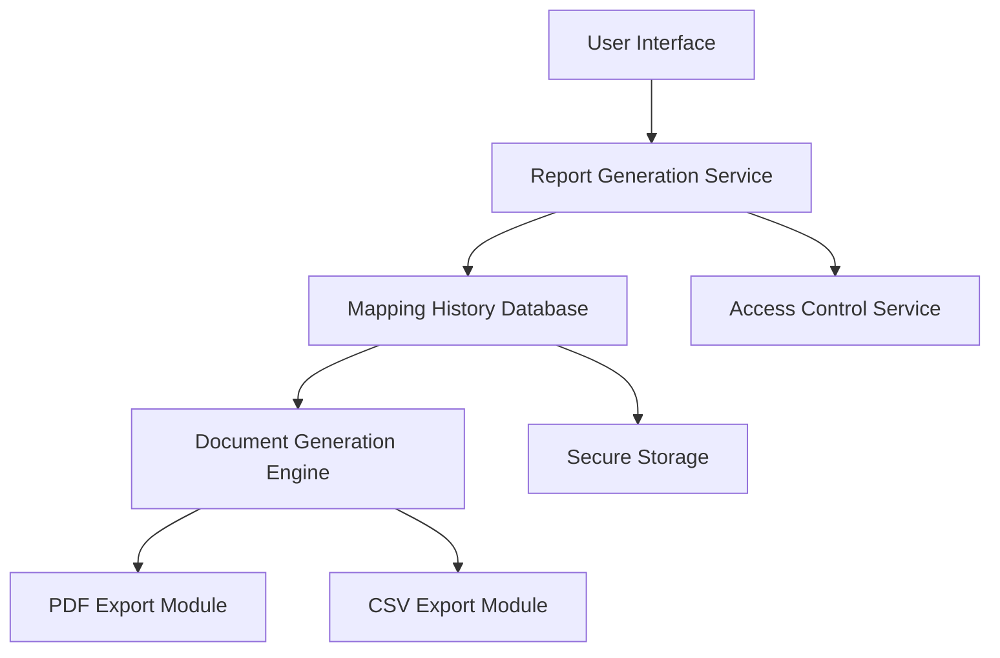

#### 1. High-Level Design

- **Summary**: This epic delivers comprehensive audit-ready reporting capabilities that generate detailed documentation of all mapping decisions, manual overrides, timestamps, and mapping history. Users can download reports in PDF or CSV format with complete traceability of the mapping process, supporting compliance requirements and internal audits. The system maintains a complete mapping history accessible to authorized users for minimum 7 years, enabling retrospective review and ensuring 100% audit compliance for M&A integration projects.

- **Component Flow**:

- **Integration Points**: 
  - Document generation services for PDF/CSV export
  - Secure storage infrastructure for historical mapping data (7-year retention)
  - User authentication and authorization services for history access

- **Key Assumptions**: 
  - Document generation services support PDF and CSV formats with audit trail requirements
  - Secure storage infrastructure provides 7-year data retention with AES-256 encryption

- **NFR Highlights**: Reports must be generated within 60 seconds of request; System must retain mapping history for minimum 7 years for audit purposes; All reports must include complete audit trail with timestamps; Interface must meet WCAG 2.1 AA accessibility standards including keyboard navigation and screen reader compatibility; Data storage encrypted using AES-256

#### 2. Validation Report

- **Requirements Coverage**: The design covers all stated scope including audit-ready report generation (PDF/CSV formats), mapping decision logging with timestamps, manual override tracking and documentation, mapping history access and retrieval, previous report download capability, and contextual help and support resources. All NFRs are addressed including performance (60-second report generation), data retention (7-year minimum), audit trail completeness, accessibility (WCAG 2.1 AA), and security (AES-256 encryption).

- **Gap Analysis**: No significant gaps identified. The epic clearly defines scope, user value, NFRs, dependencies, and out-of-scope items. Accessibility requirements are explicitly stated, demonstrating enterprise-grade compliance focus.

- **Risk Assessment**: 
  - Storage capacity planning for 7-year retention of mapping history at scale (1M accounts/month)
  - Report generation performance for large historical datasets
  - Accessibility compliance validation across all report formats

- **Compliance Validation**: GDPR compliance supported through complete audit trail and data retention policies; WCAG 2.1 AA accessibility standards explicitly required; AES-256 encryption for data storage specified; achieves 100% audit compliance target (up from 70% baseline).