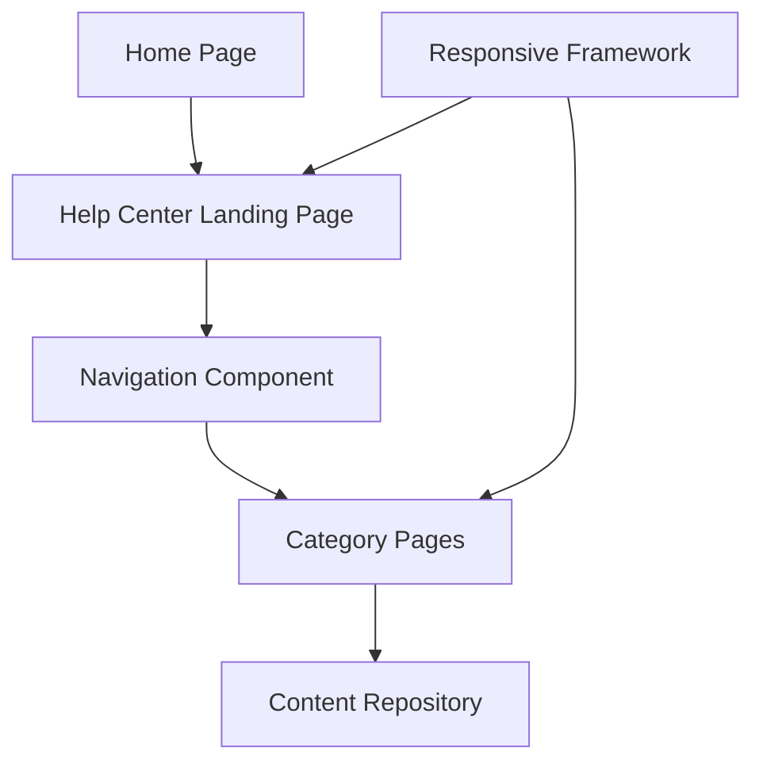

#### 1. High-Level Design

- **Summary**: This epic establishes the foundational Help Center infrastructure with a prominent entry point on the Home Page, a dedicated landing page with organized categories (Getting Started, FAQs, How-to Guides, Video Tutorials, Help Materials, Troubleshooting, Chat Support, Search Help), intuitive navigation, responsive design across all devices, and full branding/accessibility compliance.

- **Component Flow**:

- **Integration Points**: 
  - Existing Home Page layout and functionality (internal)
  - Existing website design and branding assets (internal)
  - Responsive framework (internal)
  - Web analytics tracking system (internal)

- **Key Assumptions**: 
  - Existing responsive framework supports mobile-first design patterns required for Help Center
  - Web analytics tracking system can be extended to capture Help Center navigation events without custom implementation

- **NFR Highlights**: Help Center pages must load within 2 seconds for 95% of requests; 99.9% uptime with automated monitoring; support 10,000 concurrent users; WCAG 2.1 AA compliance including keyboard navigation, screen reader support, and color contrast; all content over HTTPS

- **Data Flow**: User clicks Help Center entry point on Home Page → Navigation routes to Help Center Landing Page → Landing Page loads category structure from Content Repository via Navigation Component → User selects category → Navigation Component routes to specific Category Page → Category Page retrieves and displays relevant content from Content Repository. Responsive Framework ensures appropriate layout rendering based on device type. All page loads and navigation events tracked by web analytics system.

#### 2. Validation Report

- **Requirements Coverage**: The design covers all scope elements including Help Center entry point on Home Page, dedicated landing page, categorized content organization (8 categories specified), category-based browsing, responsive design for desktop/tablet/mobile, branding and WCAG 2.1 AA accessibility compliance, navigation structure, and fallback messaging. The architecture supports all NFRs including 2-second load times, 10,000 concurrent users, 99.9% uptime, full accessibility standards, and HTTPS delivery. All dependencies on existing Home Page, branding assets, responsive framework, and analytics are explicitly integrated into the component flow.