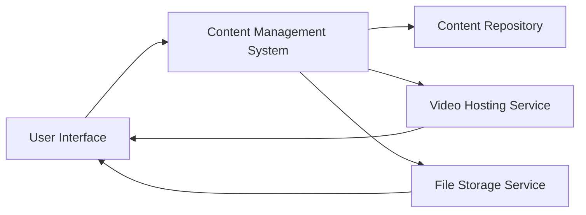

#### 1. High-Level Design

- **Summary**: This epic provides a multi-format content delivery system supporting text articles, FAQs, embedded video tutorials, and downloadable materials (PDFs, guides, training documents). The system ensures seamless playback of videos within the Help Center, secure downloads, graceful error handling for unavailable resources, and content filtering capabilities by category, popularity, and recency.

- **Component Flow**:

- **Integration Points**: 
  - Video hosting and streaming infrastructure (external/CDN)
  - File storage and download services (internal/cloud storage)
  - Content management system for help materials (internal)
  - Documentation and support teams (content providers)

- **Key Assumptions**: 
  - Video hosting service provides adaptive streaming for different bandwidth conditions
  - File storage service supports secure, tokenized download URLs with expiration for HTTPS delivery

- **NFR Highlights**: Content and pages must load within 2 seconds for 95% of requests; video playback initiates within 2 seconds; all downloads over HTTPS; system supports 10,000 concurrent users without degradation

- **Data Flow**: User navigates to help content → Content Management System retrieves metadata from Content Repository → For videos: CMS provides embedded player with stream URL from Video Hosting Service → Video streams directly to user. For downloads: CMS generates secure download link from File Storage Service → User downloads file over HTTPS. For text content: CMS serves articles/FAQs directly from Content Repository. Error handling intercepts failed requests and serves alternative suggestions from CMS.

#### 2. Validation Report

- **Requirements Coverage**: The design addresses all scope elements including text articles, FAQs, embedded video tutorials with playback controls, downloadable materials, error messaging for unavailable resources, alternative action suggestions, and content filtering. The architecture supports NFRs for 2-second load times, 2-second video playback initiation, HTTPS delivery, and 10,000 concurrent users. All dependencies on video hosting, file storage, CMS, and content teams are mapped to specific components in the architecture.