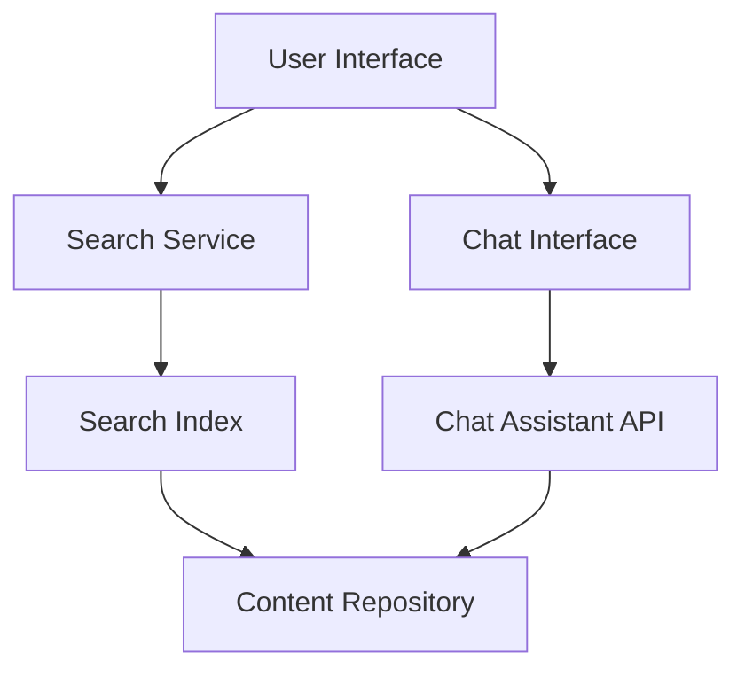

#### 1. High-Level Design

- **Summary**: This epic delivers a dual-channel support system enabling users to find help content through keyword-based search (indexing articles, videos, and downloadable materials) and access real-time assistance via an integrated chat assistant. Both features must deliver results within 2 seconds and maintain consistent branding and accessibility across all devices.

- **Component Flow**:

- **Integration Points**: 
  - Third-party chat assistant API (external service)
  - Search indexing service (internal/external)
  - Existing help content repository (internal)
  - Chat assistant provider service (external)

- **Key Assumptions**: 
  - Search indexing service supports real-time or near-real-time content updates as new help materials are added
  - Chat assistant API provides pre-trained natural language processing capabilities without requiring custom training

- **NFR Highlights**: Search results and chat window must load within 2 seconds for 95% of requests; system must support 10,000 concurrent users; WCAG 2.1 AA compliance required; all interactions over HTTPS; no sensitive user data exposure in chat

- **Data Flow**: User enters search keywords → Search Service queries Search Index → Index returns ranked results from Content Repository → Results displayed to user. For chat: User sends message via Chat Interface → Message sent to Chat Assistant API → API processes query and retrieves relevant content from Content Repository → Response with links to articles returned to user in real-time.

#### 2. Validation Report

- **Requirements Coverage**: The design covers all stated scope elements including keyword search, content indexing, search results ranking, chat assistant integration, chat window interface, chat-to-article linking, real-time messaging, and mobile accessibility. The architecture supports the NFRs for 2-second response times, 10,000 concurrent users, HTTPS security, and WCAG 2.1 AA accessibility. Dependencies on third-party chat API, search indexing service, and content repository are explicitly addressed in the integration points.