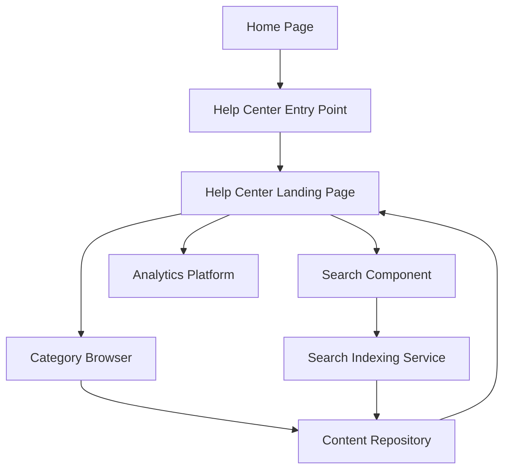

#### 1. High-Level Design

- **Summary**: This epic establishes a comprehensive Help Center accessible from the Home Page, providing users with organized self-service support through categorized content (Getting Started, FAQs, How-to Guides, Video Tutorials, Help Materials, Troubleshooting, Chat Support, Search Help). The solution includes a prominent entry point, dedicated landing page, category browsing, keyword search functionality, and fully responsive design across all devices while maintaining existing Home Page layout integrity and brand consistency.

- **Component Flow**:

- **Integration Points**: 
  - **Internal**: Existing website Home Page for entry point integration
  - **Internal**: Existing website design and branding assets for visual consistency
  - **Internal**: Responsive framework compatibility for cross-device support
  - **Upstream**: Web analytics platform for tracking Help Center access and usage metrics
  - **Internal**: Content repository/CMS for organized help content storage and retrieval

- **Key Assumptions**: 
  - The existing Home Page framework allows for non-intrusive addition of a Help Center entry point (e.g., header navigation, footer link, or prominent button) without layout disruption
  - A search indexing service or capability exists or can be implemented to support keyword-based content discovery

- **NFR Highlights**: Help Center pages and search results must load within 2 seconds for 95% of requests; support 10,000 concurrent users; 99.9% uptime with automated monitoring; WCAG 2.1 AA accessibility including keyboard navigation and screen reader support

- **Data Flow**: User visits Home Page → Clicks Help Center entry point → Help Center Landing Page loads with categorized content navigation → User either browses by category (Category Browser queries Content Repository) or searches by keyword (Search Component queries Search Indexing Service) → Content Repository returns matching content → Help Center displays results → User interactions tracked by Analytics Platform → Responsive design adapts layout based on device type (desktop, tablet, mobile)

#### 2. Validation Report

- **Requirements Coverage**: The design fully addresses the epic's scope including Help Center entry point on Home Page, dedicated landing page, all eight specified categories (Getting Started, FAQs, How-to Guides, Video Tutorials, Help Materials, Troubleshooting, Chat Support, Search Help), browse and search functionality, responsive design for all devices, branding/accessibility compliance, and meaningful error messaging. All NFRs are satisfied through optimized architecture (2-second load time, 10,000 concurrent users), uptime monitoring (99.9% availability), and accessibility standards (WCAG 2.1 AA). Dependencies on existing website assets, responsive framework, and analytics platform are explicitly integrated. The solution maintains Home Page layout integrity as specified in the scope.