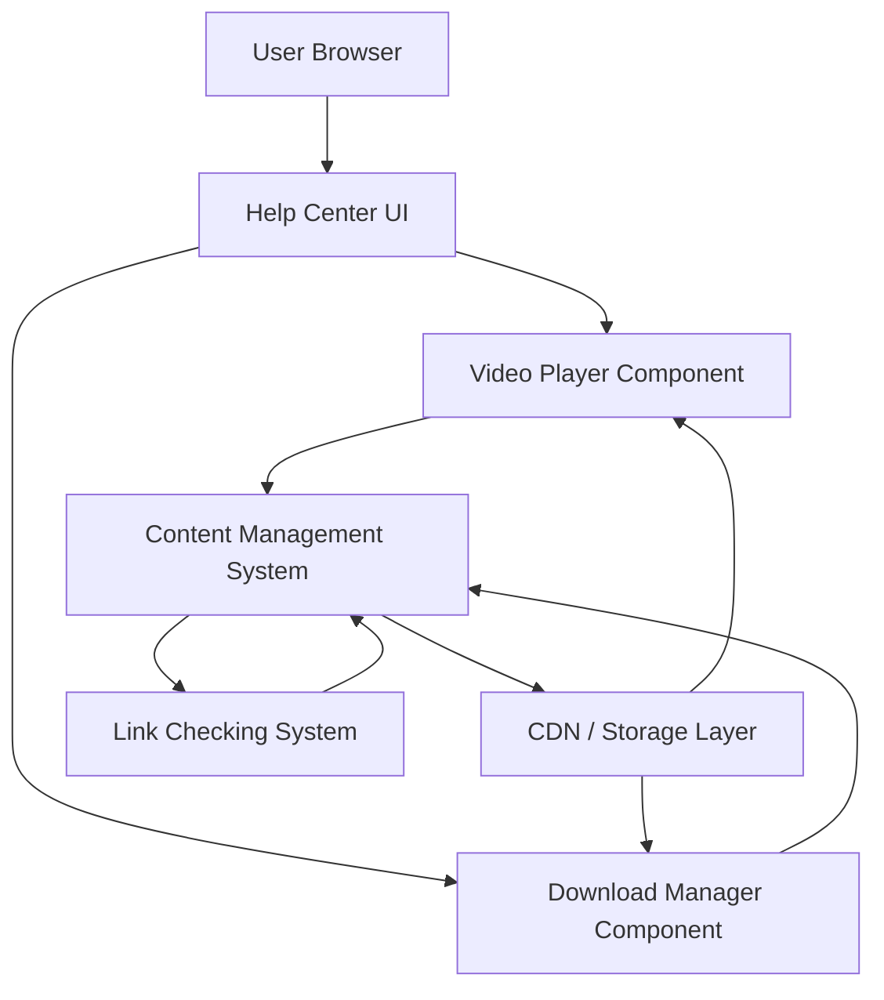

#### 1. High-Level Design

- **Summary**: This epic enables users to access and consume rich multimedia content within the Help Center, including embedded video tutorials with playback controls and downloadable resources (user guides, quick reference guides, FAQs, PDFs, training documents). The solution provides secure HTTPS delivery, meaningful error handling for unavailable resources, and supports diverse learning formats for both online and offline user access.

- **Component Flow**:

- **Integration Points**: 
  - **Upstream**: Content Management System (CMS) for hosting and managing video tutorials and downloadable materials
  - **Internal**: Availability of help content from documentation and support teams
  - **Internal**: Automated link checking system for resource availability monitoring
  - **Infrastructure**: CDN or storage layer for efficient content delivery
  - **Security**: HTTPS protocol for secure delivery of all materials

- **Key Assumptions**: 
  - Video content is stored in web-compatible formats (e.g., MP4, WebM) that support HTML5 video playback without additional plugins
  - The CMS provides API endpoints to retrieve content metadata, availability status, and download URLs

- **NFR Highlights**: Video and download resources must load within 2 seconds for 95% of requests; support 10,000 concurrent users; HTTPS encryption mandatory; WCAG 2.1 AA accessibility compliance for multimedia content

- **Data Flow**: User navigates to multimedia content in Help Center → Help Center UI requests content metadata from CMS → For video: Video Player Component streams content from CDN/Storage via HTTPS → For downloads: Download Manager Component retrieves file from CMS/Storage and initiates browser download → Link Checking System continuously monitors resource availability → If resource unavailable, CMS returns error with alternative suggestions → Help Center UI displays meaningful error message to user

#### 2. Validation Report

- **Requirements Coverage**: The design comprehensively addresses the epic's scope including embedded video playback with controls, downloadable materials (guides, FAQs, PDFs, training documents), view/download functionality, and meaningful error messaging with alternatives. All NFRs are satisfied through CDN/storage architecture (performance and scalability), HTTPS enforcement (security), and accessibility standards compliance. Dependencies on CMS, documentation teams, and link checking system are explicitly integrated. The solution supports diverse learning formats as specified in the user value proposition.