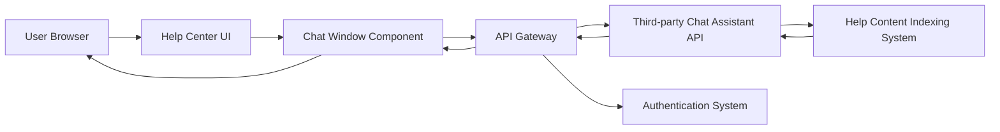

#### 1. High-Level Design

- **Summary**: This epic implements an interactive chat assistant accessible from the Help Center that provides real-time conversational support to users. The solution enables users to receive immediate answers to questions, access relevant help articles, and resolve issues without submitting support tickets. The system ensures secure HTTPS communication, protects sensitive user data, and delivers fast response times while supporting up to 10,000 concurrent users.

- **Component Flow**:

- **Integration Points**: 
  - **Upstream**: Third-party chat assistant API for conversational AI capabilities
  - **Internal**: Existing website authentication system for user context and session management
  - **Internal**: Help content indexing system for article recommendations and search
  - **Security**: HTTPS protocol enforcement for all chat interactions

- **Key Assumptions**: 
  - The third-party chat assistant API provides a REST or WebSocket interface with documented authentication mechanisms
  - User context (authentication state, user ID) can be securely passed to the chat assistant for personalized responses

- **NFR Highlights**: Chat window must open within 2 seconds; support 10,000 concurrent users; HTTPS encryption mandatory; WCAG 2.1 AA accessibility compliance; no sensitive user data exposure

- **Data Flow**: User initiates chat from Help Center → Chat window component authenticates user via authentication system → User query sent over HTTPS to API Gateway → Gateway forwards to third-party chat assistant API → Chat assistant processes query and queries help content indexing system for relevant articles → Response with answer and article links returned through API Gateway → Chat window displays response to user in real-time

#### 2. Validation Report

- **Requirements Coverage**: The design fully covers the epic's stated scope including chat assistant accessibility from Help Center, real-time messaging, chat window interface with activation/response functionality, article link recommendations, and secure HTTPS communication. All NFRs are addressed through component architecture (performance), security layer (HTTPS/data protection), and accessibility standards compliance. Dependencies on third-party API, authentication system, and content indexing are explicitly mapped in the integration points.