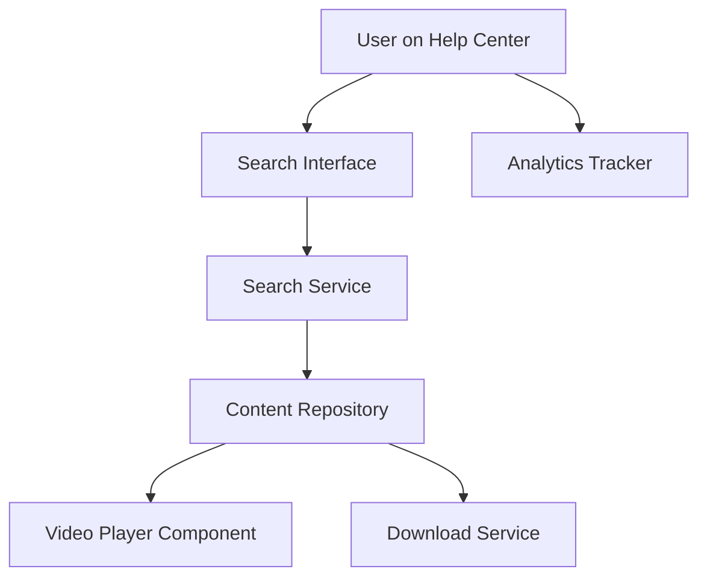

#### 1. High-Level Design

- **Summary**: This epic provides comprehensive help content delivery including text articles, FAQs, embedded video tutorials, and downloadable materials, combined with robust keyword search functionality. Users can search across all content types with filtering options, view/play content in-place, and download materials for offline use. Analytics track user interactions for continuous improvement.

- **Component Flow**:

- **Integration Points**: 
  - Upstream: Existing website infrastructure and CMS, editorial team content creation workflows
  - Downstream: Video hosting platform for tutorials, file storage/CDN for downloadable materials, search indexing service, analytics platform

- **Key Assumptions**: 
  - Video content is hosted on a compatible streaming platform (e.g., YouTube, Vimeo, or internal CDN)
  - Search uses full-text indexing with support for filtering and categorization metadata

- **NFR Highlights**: Video load/play within 3 seconds; downloads begin within 2 seconds; search results within 2 seconds; support 100,000 concurrent users; HTTPS only; WCAG 2.1 AA compliant

- **Data Flow**: User enters search query → Search Service queries indexed Content Repository → Results returned with filtering options (category, content type) → User selects content → Text/FAQ displayed inline, video streamed via Video Player Component, or file delivered via Download Service over HTTPS → User interactions (searches, views, downloads, video plays) captured by Analytics Tracker → Analytics aggregated for editorial team to improve content

#### 2. Validation Report

- **Requirements Coverage**: The design fully addresses all requirements including multiple content formats (text, FAQ, video, downloadable materials), keyword search with filtering, in-place viewing/playback, download capability, user interaction tracking, and multi-content-type support. All NFRs (load times, concurrent user capacity, HTTPS, accessibility) are supported through appropriate service architecture, CDN usage, and platform capabilities.