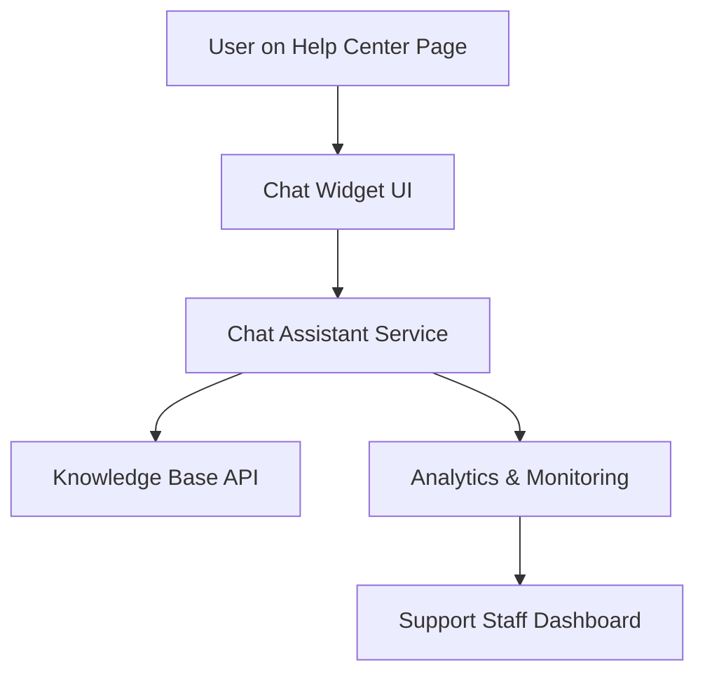

#### 1. High-Level Design

- **Summary**: This epic delivers an interactive chat assistant integrated into the Help Center landing page, providing real-time automated support to users. The assistant responds to queries, provides contextual links to help articles, and supports up to 10,000 simultaneous sessions with sub-2-second response times. Support staff can monitor interactions to improve content.

- **Component Flow**:

- **Integration Points**: 
  - Upstream: Existing website infrastructure, Help Center landing page
  - Downstream: Chat assistant technology platform (third-party or internal), knowledge base/CMS for article retrieval, analytics platform for interaction tracking

- **Key Assumptions**: 
  - Chat assistant platform supports RESTful API integration for knowledge base queries
  - Natural language processing capabilities are provided by the selected chat platform

- **NFR Highlights**: Chat window must open within 2 seconds; support 10,000 simultaneous sessions; 99.9% uptime; HTTPS only; WCAG 2.1 AA compliant; no sensitive data exposure

- **Data Flow**: User initiates chat from Help Center page → Chat widget captures user query → Query sent to Chat Assistant Service → Service queries Knowledge Base API for relevant articles → Assistant generates response with contextual links → Response displayed to user in chat window → Interaction data logged to Analytics & Monitoring → Support staff access aggregated insights via Dashboard

#### 2. Validation Report

- **Requirements Coverage**: The design covers all stated requirements including real-time chat capability, automated responses, contextual linking to help articles, simultaneous session support (10,000), monitoring capability for support staff, security (HTTPS), and responsive interface. All NFRs (2-second load, session capacity, uptime, accessibility, security) are addressed through appropriate architectural components and platform selection criteria.