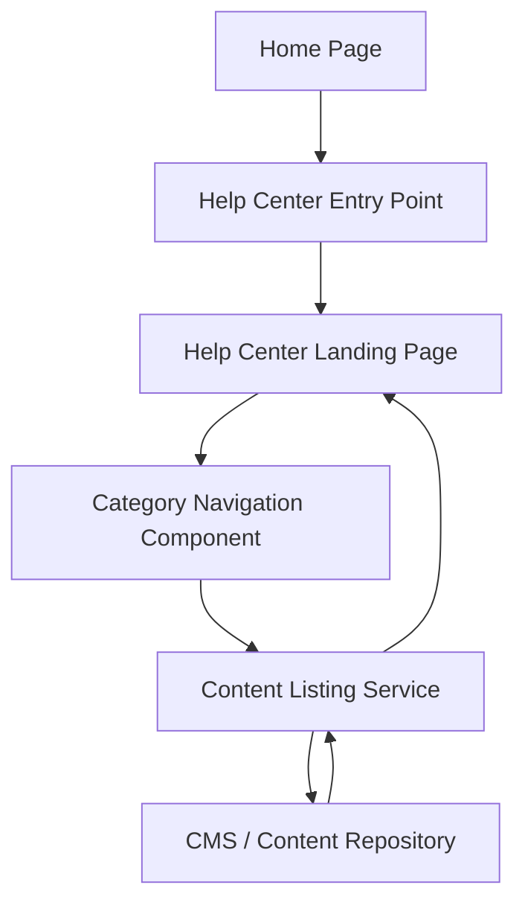

#### 1. High-Level Design

- **Summary:** Create a dedicated Help Center accessible from the Home Page via a prominent navigation entry point, with a landing page organizing content into logical categories (Getting Started, FAQs, Troubleshooting). The implementation must be responsive, load within 2 seconds (4 seconds on mobile), support 100,000 concurrent users, maintain 99.9% uptime, and comply with WCAG 2.1 AA accessibility and existing branding.

- **Component Flow:**

- **Integration Points:**
  - **Upstream:** Existing Home Page layout and navigation system, website branding guidelines and design system
  - **Downstream:** Existing website infrastructure and CMS for content retrieval, category metadata stored in CMS

- **Key Assumptions:**
  - Help Center entry point is added as a new navigation link in the main menu or as a prominent button/section on Home Page without disrupting existing functionality.
  - Content categories are pre-defined in CMS with metadata enabling dynamic category-based listing and navigation.

- **NFR Highlights:** Landing page load within 2 seconds (broadband) / 4 seconds (mobile); 100,000 concurrent users; 99.9% uptime with automated fallback; WCAG 2.1 AA accessibility; no disruption to existing Home Page functionality.

- **Data Flow:** User clicks Help Center entry point on Home Page → Browser navigates to Help Center landing page → Category navigation component requests category list from content listing service → Service retrieves category metadata and content summaries from CMS → Categories and content displayed on landing page → User clicks category to browse content within that category.

#### 2. Validation Report

- **Requirements Coverage:** The design addresses all requirements: Help Center entry point on Home Page, dedicated landing page, categorized content organization (Getting Started, FAQs, Troubleshooting), responsive design, branding/accessibility compliance (WCAG 2.1 AA), and category browsing. All NFRs (load times, concurrent users, uptime, accessibility, non-disruption) are incorporated through responsive UI components, scalable infrastructure, and adherence to design system standards.