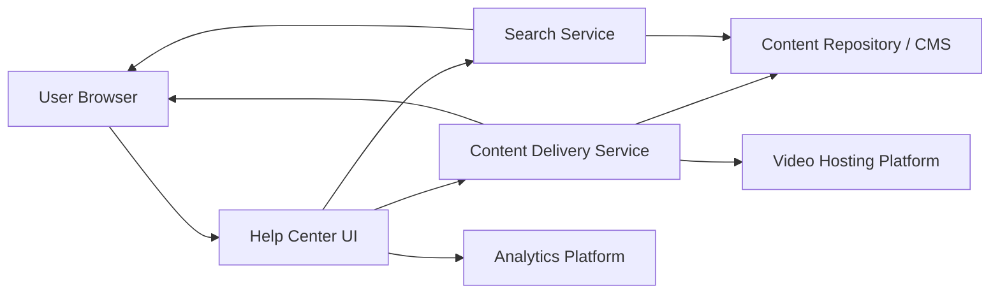

#### 1. High-Level Design

- **Summary:** Deliver multi-format help content (text articles, video tutorials, downloadable materials) with keyword search functionality across all content types, filtering by category/type, and robust error handling. The system must load content within 2 seconds (4 seconds on mobile), support 100,000 concurrent users, maintain 99.9% uptime, and serve all content securely over HTTPS.

- **Component Flow:**

- **Integration Points:**
  - **Upstream:** Existing website infrastructure and CMS, editorial team for content creation/maintenance
  - **Downstream:** Video hosting platform (e.g., Vimeo, YouTube, or internal CDN), analytics platform for tracking user interactions, content repository/CMS for articles and downloadable files

- **Key Assumptions:**
  - Content is indexed with metadata (category, type, keywords) to enable fast search and filtering; CDN is used for static content and video delivery.
  - Video hosting platform provides embed API with playback controls; downloadable files are stored in secure, scalable object storage.

- **NFR Highlights:** Content load within 2 seconds (broadband) / 4 seconds (mobile); video playback within 3 seconds; search results within 2 seconds; 100,000 concurrent users; 99.9% uptime; HTTPS-only delivery.

- **Data Flow:** User enters search keyword or browses category → Search service queries content repository with filters (category, type) → Results (articles, videos, downloadables) returned and displayed in UI → User selects content → Content delivery service fetches from CMS or video platform → Content rendered/played/downloaded in browser over HTTPS; all interactions logged to analytics platform.

#### 2. Validation Report

- **Requirements Coverage:** The design covers all epic requirements: multi-format content delivery (text, video, downloadable), keyword search with filtering, error handling, HTTPS delivery, and analytics tracking. All NFRs (load times, concurrent users, uptime, security) are addressed through content delivery service, CDN, and scalable search infrastructure.