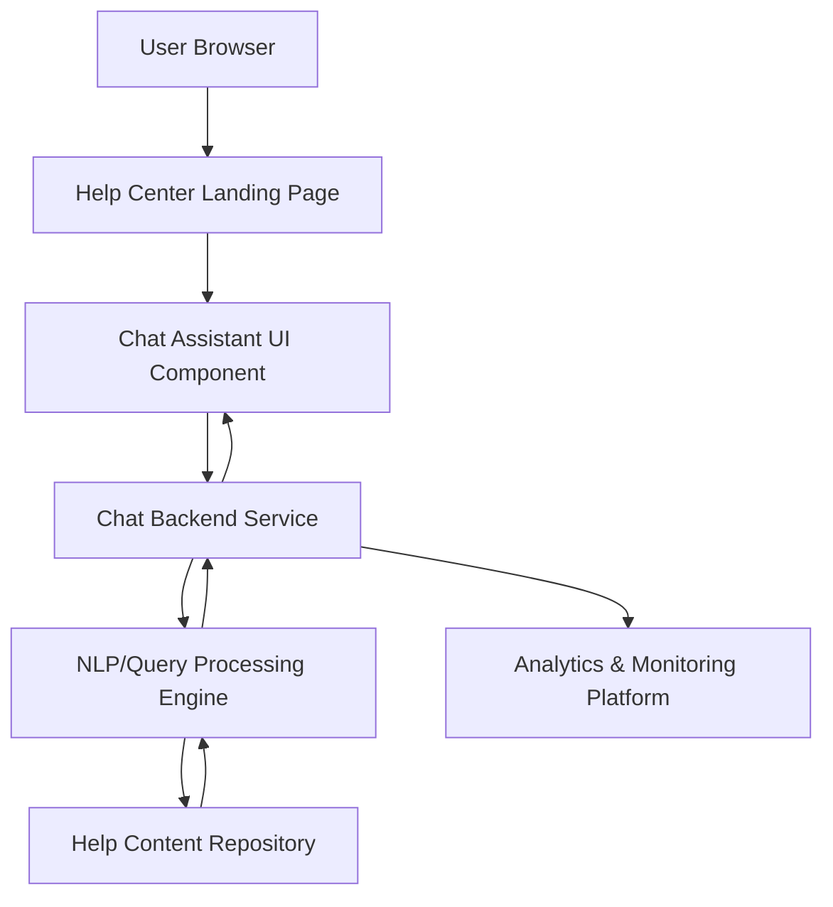

#### 1. High-Level Design

- **Summary:** Implement an interactive chat assistant on the Help Center landing page that provides automated, real-time responses to user queries, links to relevant help articles, and supports up to 10,000 simultaneous sessions with a 2-second load time. The system must maintain security (HTTPS, no sensitive data exposure) and enable support staff monitoring for continuous improvement.

- **Component Flow:**

- **Integration Points:**
  - **Upstream:** Help Center landing page (existing website infrastructure)
  - **Downstream:** Help content repository for article linking, analytics platform for interaction monitoring, chat assistant technology platform (vendor or internal NLP service)

- **Key Assumptions:**
  - Chat assistant uses a pre-trained NLP model or rule-based engine for query matching; knowledge base articles are tagged/indexed for retrieval.
  - Session management and load balancing infrastructure already exists or will be provisioned to handle 10,000 concurrent sessions.

- **NFR Highlights:** Chat window must open within 2 seconds; support 10,000 simultaneous sessions; 99.9% uptime; HTTPS-only; WCAG 2.1 AA accessibility; no sensitive data exposure.

- **Data Flow:** User types query in chat UI → Query sent to chat backend service over HTTPS → NLP/query processing engine analyzes query and retrieves relevant help article links from content repository → Response with links returned to chat backend → Displayed to user in chat UI; interaction metadata logged to analytics platform for support staff monitoring.

#### 2. Validation Report

- **Requirements Coverage:** The design addresses all stated requirements: interactive chat UI with 2-second load, automated response system, article linking, 10,000 concurrent session support, HTTPS security, no sensitive data exposure, monitoring capability, and WCAG 2.1 AA accessibility. All NFRs (performance, scalability, security, uptime, accessibility) are incorporated into the architecture.