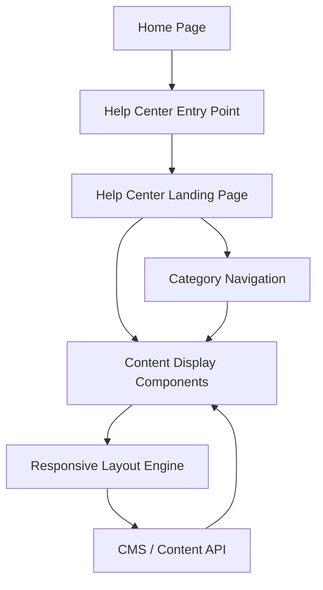

#### 1. High-Level Design

- **Summary:** Create a visually prominent Help Center entry point on the Home Page and a dedicated Help Center landing page with categorized content organization (Getting Started, FAQs, Troubleshooting). The interface must be responsive across desktop/tablet/mobile, load within 2 seconds (broadband) / 4 seconds (mobile), support 100,000 concurrent users, meet WCAG 2.1 AA standards, align with branding, and maintain 99.9% uptime without disrupting existing Home Page functionality.

- **Component Flow:**

- **Integration Points:**
  - **Upstream:** Existing Home Page layout and navigation system (provides entry point placement and branding), existing website infrastructure and CMS (for content retrieval and user session management)
  - **Downstream:** Content database/CMS (for retrieving categorized help content), design system and branding guidelines (for consistent UI styling)

- **Key Assumptions:**
  - Help Center entry point is implemented as a new navigation link or prominent button/widget on Home Page without modifying core Home Page structure.
  - Landing page uses server-side rendering or static generation with CDN caching to meet 2-second load time; responsive layout adapts via CSS media queries and progressive enhancement.

- **NFR Highlights:** Landing page loads in 2 seconds (broadband) / 4 seconds (mobile); supports 100,000 concurrent users; WCAG 2.1 AA compliant (keyboard navigation, screen readers, color contrast); HTTPS-only; 99.9% uptime.

- **Data Flow:**
  1. User navigates to Home Page
  2. Home Page renders with Help Center Entry Point visible in navigation or dedicated section
  3. User clicks Help Center Entry Point
  4. Browser requests Help Center Landing Page
  5. Responsive Layout Engine determines device type (desktop/tablet/mobile) and renders appropriate layout
  6. Landing Page fetches categorized content metadata from CMS / Content API
  7. Category Navigation displays categories (Getting Started, FAQs, Troubleshooting)
  8. Content Display Components render preview/links for each category
  9. User selects category or content item, triggering navigation to detailed content view
  10. All interactions respect accessibility standards (keyboard focus, ARIA labels, screen reader announcements)

#### 2. Validation Report

- **Requirements Coverage:** The design addresses all requirements: Help Center entry point on Home Page, dedicated landing page, categorized organization (Getting Started, FAQs, Troubleshooting), responsive design for desktop/tablet/mobile, 2-second load time (broadband) / 4-second (mobile), 100,000 concurrent users, WCAG 2.1 AA compliance, branding alignment, HTTPS delivery, 99.9% uptime, and no disruption to existing Home Page. The architecture separates navigation, layout rendering, and content retrieval for maintainability and performance optimization.